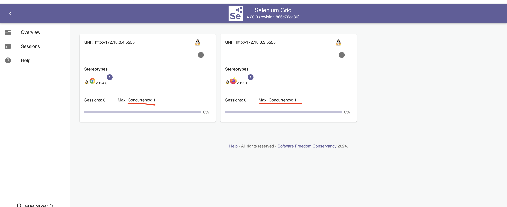
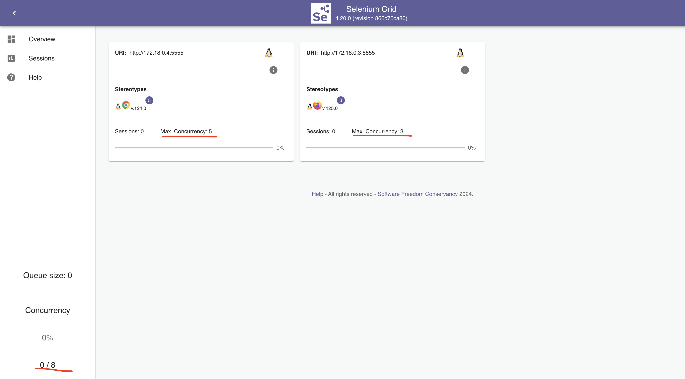

## Before increasing the sessions:
> 
## After increasing the sessions: 
> 

`SE_NODE_OVERRIDE_MAX_SESSIONS=true` if you want to override the default behavior of Selenium Grid regarding the maximum number of concurrent sessions allowed per node. By default, each node is limited to handling one session per browser instance (e.g., one Chrome, one Firefox).

By using `SE_NODE_OVERRIDE_MAX_SESSIONS=true`, you instruct Selenium to allow more than one session per node, based on the value of `SE_NODE_MAX_SESSIONS`.

Here's the updated configuration with `SE_NODE_OVERRIDE_MAX_SESSIONS=true`:

```yaml
version: "3"
services:
  selenium-grid-service:
    image: seleniarm/hub:4.20
    ports:
      - 4444:4444

  chrome-service:
    image: seleniarm/node-chromium:4.20
    shm_size: '2g'
    depends_on:
      - selenium-grid-service
    environment:
      - SE_EVENT_BUS_HOST=selenium-grid-service
      - SE_EVENT_BUS_PUBLISH_PORT=4442
      - SE_EVENT_BUS_SUBSCRIBE_PORT=4443
      - SE_NODE_MAX_SESSIONS=5  # Set the maximum number of concurrent Chrome sessions
      - SE_NODE_OVERRIDE_MAX_SESSIONS=true  # Allow overriding of default max sessions behavior

  firefox-service:
    image: seleniarm/node-firefox:4.20
    shm_size: '2g'
    depends_on:
      - selenium-grid-service
    environment:
      - SE_EVENT_BUS_HOST=selenium-grid-service
      - SE_EVENT_BUS_PUBLISH_PORT=4442
      - SE_EVENT_BUS_SUBSCRIBE_PORT=4443
      - SE_NODE_MAX_SESSIONS=5  # Set the maximum number of concurrent Firefox sessions
      - SE_NODE_OVERRIDE_MAX_SESSIONS=true  # Allow overriding of default max sessions behavior
```

### Explanation:
- **SE_NODE_OVERRIDE_MAX_SESSIONS=true**: This enables you to override the default limit of one session per browser and allows each node to run multiple browser sessions, as defined by `SE_NODE_MAX_SESSIONS`.
- **SE_NODE_MAX_SESSIONS=5**: Specifies that up to 5 sessions can run concurrently on each Chrome or Firefox node.

### When to Use `SE_NODE_OVERRIDE_MAX_SESSIONS=true`:
- Use this setting when you want each browser node to handle multiple test sessions simultaneously, which can increase test execution throughput on a single node without requiring more containers.