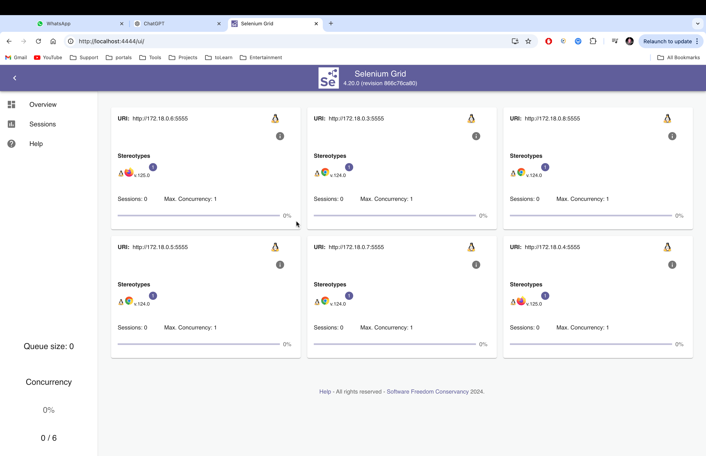

# Selenium Grid Setup with Chrome and Firefox Nodes (ARM64)

This `docker-compose.yml` file sets up a Selenium Grid using Seleniarm images for ARM64 architecture (Mac M1/M2, etc.). It includes services for the Selenium Grid Hub, Chrome nodes, and Firefox nodes. This setup uses Docker Compose version 3.

## Services

### 1. **Selenium Grid Hub (`selenium-grid-service`)**
- **Image**: `seleniarm/hub:4.20`
- **Ports**:
    - `4444:4444`: The Selenium Grid Hub will be accessible on port 4444, which is the default Selenium Grid port for running tests.

### 2. **Chrome Nodes (`chrome-service`)**
- **Image**: `seleniarm/node-chromium:4.20`
- **Shared Memory Size (`shm_size`)**:
    - Set to `'2g'` to ensure sufficient shared memory for browser operations, particularly to avoid browser crashes due to memory issues.
- **Replicas**:
    - 4 replicas of the Chrome nodes will be deployed for parallel test execution.
    
    - Yes, in Docker Compose, each replica is a new container. When you specify replicas for a service, Docker creates multiple instances (containers) of that service. Each replica is an independent container that runs the same image and configuration.
    
In your case:
- For the `chrome-service` with `replicas: 4`, Docker will create 4 separate containers, each running the `seleniarm/node-chromium:4.20` image.
- For the `firefox-service` with `replicas: 2`, Docker will create 2 separate containers, each running the `seleniarm/node-firefox:4.20` image.

These replicas will be managed by Docker, allowing for parallel browser sessions and making it easier to run tests concurrently across multiple containers.
- **Depends On**:
    - `selenium-grid-service`: Ensures that the Chrome nodes start only after the Selenium Grid Hub is up and running.
- **Environment Variables**:
    - `SE_EVENT_BUS_HOST=selenium-grid-service`: The hostname of the Selenium Grid Hub that the Chrome nodes should connect to.
    - `SE_EVENT_BUS_PUBLISH_PORT=4442`: Port on which Chrome nodes will publish events.
    - `SE_EVENT_BUS_SUBSCRIBE_PORT=4443`: Port on which Chrome nodes will subscribe to events.

### 3. **Firefox Nodes (`firefox-service`)**
- **Image**: `seleniarm/node-firefox:4.20`
- **Shared Memory Size (`shm_size`)**:
    - Set to `'2g'`, similar to Chrome, to avoid memory-related browser crashes.
- **Replicas**:
    - 2 replicas of the Firefox nodes will be deployed.
    - Yes, in Docker Compose, each replica is a new container. When you specify replicas for a service, Docker creates multiple instances (containers) of that service. Each replica is an independent container that runs the same image and configuration.

In your case:
- For the `chrome-service` with `replicas: 4`, Docker will create 4 separate containers, each running the `seleniarm/node-chromium:4.20` image.
- For the `firefox-service` with `replicas: 2`, Docker will create 2 separate containers, each running the `seleniarm/node-firefox:4.20` image.

These replicas will be managed by Docker, allowing for parallel browser sessions and making it easier to run tests concurrently across multiple containers.
- **Depends On**:
    - `selenium-grid-service`: Ensures that the Firefox nodes start only after the Selenium Grid Hub is up and running.
- **Environment Variables**:
    - `SE_EVENT_BUS_HOST=selenium-grid-service`: The hostname of the Selenium Grid Hub that the Firefox nodes should connect to.
    - `SE_EVENT_BUS_PUBLISH_PORT=4442`: Port on which Firefox nodes will publish events.
    - `SE_EVENT_BUS_SUBSCRIBE_PORT=4443`: Port on which Firefox nodes will subscribe to events.

## Key Notes:
- **Replicas**:
    - This configuration deploys 4 Chrome and 2 Firefox instances to allow for parallel testing.
- **Shared Memory (`shm_size`)**:
    - Increasing the shared memory to 2GB (`'2g'`) is essential to avoid out-of-memory issues in headless browser sessions.
- **Depends On**:
    - Both Chrome and Firefox nodes depend on the Selenium Grid Hub, ensuring that the Hub is ready before the nodes attempt to register themselves.
