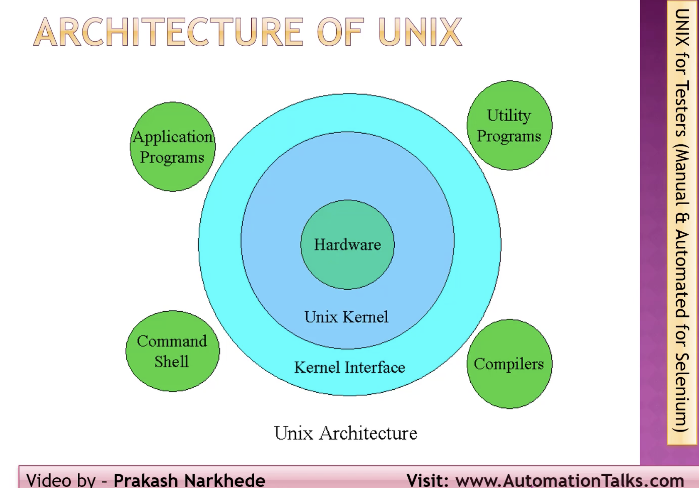

# Unix Architecture:

> - **Layer-1**: Hardware: It consists of all hardware related information.
> - **Layer-2**: Kernel: This is the core of the Operating System. It is a software that acts as the interface between the hardware and the software. Most of the tasks like memory management, file management, network management, process management, etc., are done by the kernel.
> - **Layer-3**: Shell commands: This is the interface between the user and the kernel. Shell is the utility that processes your requests. When you type in a command at the terminal, the shell interprets the command and calls the program that you want. There are various commands like cp, mv, cat, grep, id, wc, nroff, a.out and more.
> - **Layer-4**: Application Layer: It is the outermost layer that executes the given external applications.

# Unix Commands:
| Sr. no | [Command (playlist link https://youtube.com/playlist?list=PLUDwpEzHYYLtjJWMCJJDoPXjeSfzrCF-F&si=Us2oluI9b7WIpafz)](https://youtube.com/playlist?list=PLUDwpEzHYYLtjJWMCJJDoPXjeSfzrCF-F&si=Us2oluI9b7WIpafz))                                                                                                                                                                                                                                                                                                                                                                                                                                                                                                                                                                                                                                                                                                                                                                                                                                                                                                                                                                                                                                                                                                                                                                                                                                                                                                                                                                                                                                                                                                                                                                                                                                                                                                                         | Description                                                                                                                                                                                                                                                                                                                                                                                                                                                                                                                                                                                                                                                                                                                                                                                                                                                                                                                                                                                                                                                                                                                                                                                                                                                                                                                                                                                                                                                                                                                                                                                                                                                                                                                                                                                                                                                                                                                                                                                                                                                                                                                                                                                                                                                                                                                                                                                                                                                                                                                                                 | Command tags |
| ------ | ------------------------------------------------------------------------------------------------------------------------------------------------------------------------------------------------------------------------------------------------------------------------------------------------------------------------------------------------------------------------------------------------------------------------------------------------------------------------------------------------------------------------------------------------------------------------------------------------------------------------------------------------------------------------------------------------------------------------------------------------------------------------------------------------------------------------------------------------------------------------------------------------------------------------------------------------------------------------------------------------------------------------------------------------------------------------------------------------------------------------------------------------------------------------------------------------------------------------------------------------------------------------------------------------------------------------------------------------------------------------------------------------------------------------------------------------------------------------------------------------------------------------------------------------------------------------------------------------------------------------------------------------------------------------------------------------------------------------------------------------------------------------------------------------------------------------------------------------------------------------------------------------------------------------------------- | ----------------------------------------------------------------------------------------------------------------------------------------------------------------------------------------------------------------------------------------------------------------------------------------------------------------------------------------------------------------------------------------------------------------------------------------------------------------------------------------------------------------------------------------------------------------------------------------------------------------------------------------------------------------------------------------------------------------------------------------------------------------------------------------------------------------------------------------------------------------------------------------------------------------------------------------------------------------------------------------------------------------------------------------------------------------------------------------------------------------------------------------------------------------------------------------------------------------------------------------------------------------------------------------------------------------------------------------------------------------------------------------------------------------------------------------------------------------------------------------------------------------------------------------------------------------------------------------------------------------------------------------------------------------------------------------------------------------------------------------------------------------------------------------------------------------------------------------------------------------------------------------------------------------------------------------------------------------------------------------------------------------------------------------------------------------------------------------------------------------------------------------------------------------------------------------------------------------------------------------------------------------------------------------------------------------------------------------------------------------------------------------------------------------------------------------------------------------------------------------------------------------------------------------------------------- | ------------ |
| 1      | asismisr@CTIPL-MAC-348 lynxPlayground % cat >myFile.txt hello, im creating the file content during run time. ^C asismisr@CTIPL-MAC-348 lynxPlayground %                                                                                                                                                                                                                                                                                                                                                                                                                                                                                                                                                                                                                                                                                                                                                                                                                                                                                                                                                                                                                                                                                                                                                                                                                                                                                                                                                                                                                                                                                                                                                                                                                                                                                                                                                                      | This cat command will allow you to create a file along with entering the content during the execution. once the file content is done, user has to break it.                                                                                                                                                                                                                                                                                                                                                                                                                                                                                                                                                                                                                                                                                                                                                                                                                                                                                                                                                                                                                                                                                                                                                                                                                                                                                                                                                                                                                                                                                                                                                                                                                                                                                                                                                                                                                                                                                                                                                                                                                                                                                                                                                                                                                                                                                                                                                                                                 | cat          |
| 2      | asismisr@CTIPL-MAC-348 lynxPlayground % cat myfile.txt hello, im creating the file content during run time. asismisr@CTIPL-MAC-348 lynxPlayground %                                                                                                                                                                                                                                                                                                                                                                                                                                                                                                                                                                                                                                                                                                                                                                                                                                                                                                                                                                                                                                                                                                                                                                                                                                                                                                                                                                                                                                                                                                                                                                                                                                                                                                                                                                             | this cat command will display the content of the file.                                                                                                                                                                                                                                                                                                                                                                                                                                                                                                                                                                                                                                                                                                                                                                                                                                                                                                                                                                                                                                                                                                                                                                                                                                                                                                                                                                                                                                                                                                                                                                                                                                                                                                                                                                                                                                                                                                                                                                                                                                                                                                                                                                                                                                                                                                                                                                                                                                                                                                      | cat          |
| 3      | asismisr@CTIPL-MAC-348 lynxPlayground % cat >fileOne.text                         File one content ^C asismisr@CTIPL-MAC-348 lynxPlayground % cat >fileTwo.txt                          File two content ^C asismisr@CTIPL-MAC-348 lynxPlayground % cat >fileThree.txt File three content ^C asismisr@CTIPL-MAC-348 lynxPlayground % cat fileOne.text fileTwo.txt fileThree.txt File one content File two content File three content asismisr@CTIPL-MAC-348 lynxPlayground % cat fileOne.text fileTwo.txt              File one content File two content asismisr@CTIPL-MAC-348 lynxPlayground %                                                                                                                                                                                                                                                                                                                                                                                                                                                                                                                                                                                                                                                                                                                                                                                                                                                                                                                                                                                                                                                                                                                                                                                                                                                                                      | we can also use cat command to combine content of multiple files. Note: this command will not create a file with combined content.                                                                                                                                                                                                                                                                                                                                                                                                                                                                                                                                                                                                                                                                                                                                                                                                                                                                                                                                                                                                                                                                                                                                                                                                                                                                                                                                                                                                                                                                                                                                                                                                                                                                                                                                                                                                                                                                                                                                                                                                                                                                                                                                                                                                                                                                                                                                                                                                                       | cat          |
| 4      | asismisr@CTIPL-MAC-348 lynxPlayground % cat fileOne.text File one content asismisr@CTIPL-MAC-348 lynxPlayground % cat >>fileOne.text Appending the new content to file ^C asismisr@CTIPL-MAC-348 lynxPlayground % cat fileOne.text File one content Appending the new content to file asismisr@CTIPL-MAC-348 lynxPlayground %                                                                                                                                                                                                                                                                                                                                                                                                                                                                                                                                                                                                                                                                                                                                                                                                                                                                                                                                                                                                                                                                                                                                                                                                                                                                                                                                                                                                                                                                                                                                                                                 | This command can be used to append data into and existing file.                                                                                                                                                                                                                                                                                                                                                                                                                                                                                                                                                                                                                                                                                                                                                                                                                                                                                                                                                                                                                                                                                                                                                                                                                                                                                                                                                                                                                                                                                                                                                                                                                                                                                                                                                                                                                                                                                                                                                                                                                                                                                                                                                                                                                                                                                                                                                                                                                                                                                             | cat          |
| 5      | asismisr@CTIPL-MAC-348 lynxPlayground % cat >source.txt This data is precious. ^C asismisr@CTIPL-MAC-348 lynxPlayground % cp source.txt destination.txt asismisr@CTIPL-MAC-348 lynxPlayground % cat destination.txt This data is precious. asismisr@CTIPL-MAC-348 lynxPlayground %                                                                                                                                                                                                                                                                                                                                                                                                                                                                                                                                                                                                                                                                                                                                                                                                                                                                                                                                                                                                                                                                                                                                                                                                                                                                                                                                                                                                                                                                                                                                                                                                                                  | The cp command will copy the content of one file to another file. \- If suppose the Destination file does not exist it will create a new one. \- If supose the destination file exist, it will replace the entire content of it with the copied data                                                                                                                                                                                                                                                                                                                                                                                                                                                                                                                                                                                                                                                                                                                                                                                                                                                                                                                                                                                                                                                                                                                                                                                                                                                                                                                                                                                                                                                                                                                                                                                                                                                                                                                                                                                                                                                                                                                                                                                                                                                                                                                                                                                                                                                                                                  | cp           |
| 6      | asismisr@CTIPL-MAC-348 lynxPlayground % cat destination.txt                This data is precious. asismisr@CTIPL-MAC-348 lynxPlayground % mv destination.txt finalDestination.txt asismisr@CTIPL-MAC-348 lynxPlayground % cat finalDestination.txt This data is precious. asismisr@CTIPL-MAC-348 lynxPlayground % cat destination.txt cat: destination.txt: No such file or directory asismisr@CTIPL-MAC-348 lynxPlayground %                                                                                                                                                                                                                                                                                                                                                                                                                                                                                                                                                                                                                                                                                                                                                                                                                                                                                                                                                                                                                                                                                                                                                                                                                                                                                                                                                                                                                                                                                 | The mv  command can be used for below operations: \- Rename the file \- rename the directory \- Move file from 1 directory to another                                                                                                                                                                                                                                                                                                                                                                                                                                                                                                                                                                                                                                                                                                                                                                                                                                                                                                                                                                                                                                                                                                                                                                                                                                                                                                                                                                                                                                                                                                                                                                                                                                                                                                                                                                                                                                                                                                                                                                                                                                                                                                                                                                                                                                                                                                                                                                                                              | mv           |
| 7      | asismisr@CTIPL-MAC-348 lynxPlayground % ls    fileOne.text                fileThree.txt                finalDestination.txt        myFile.txt fileThree.text                fileTwo.txt                lynxCommands.docx        source.txt asismisr@CTIPL-MAC-348 lynxPlayground % mkdir mydir asismisr@CTIPL-MAC-348 lynxPlayground % ls fileOne.text                fileThree.txt                finalDestination.txt        myFile.txt                source.txt fileThree.text                fileTwo.txt                lynxCommands.docx        mydir asismisr@CTIPL-MAC-348 lynxPlayground % mv mydir yourdir asismisr@CTIPL-MAC-348 lynxPlayground % ls fileOne.text                fileThree.txt                finalDestination.txt        myFile.txt                yourdir fileThree.text                fileTwo.txt                lynxCommands.docx        source.txt asismisr@CTIPL-MAC-348 lynxPlayground %                                                                                                                                                                                                                                                                                                                                                                                                                                                                                                                                                                                                                                                                                                                                                                                                                                                                                                                                                                          | using mv command to rename a directory                                                                                                                                                                                                                                                                                                                                                                                                                                                                                                                                                                                                                                                                                                                                                                                                                                                                                                                                                                                                                                                                                                                                                                                                                                                                                                                                                                                                                                                                                                                                                                                                                                                                                                                                                                                                                                                                                                                                                                                                                                                                                                                                                                                                                                                                                                                                                                                                                                                                                                                      | mv           |
| 8      | asismisr@CTIPL-MAC-348 lynxPlayground % ls fileOne.text                fileTwo.txt                myFile.txt fileThree.text                finalDestination.txt        source.txt fileThree.txt                lynxCommands.docx        yourdir asismisr@CTIPL-MAC-348 lynxPlayground % cat fileToMove cat: fileToMove: No such file or directory asismisr@CTIPL-MAC-348 lynxPlayground % ls fileOne.text                fileTwo.txt                myFile.txt fileThree.text                finalDestination.txt        source.txt fileThree.txt                lynxCommands.docx        yourdir asismisr@CTIPL-MAC-348 lynxPlayground % touch fileToMove asismisr@CTIPL-MAC-348 lynxPlayground % ls fileOne.text                fileTwo.txt                source.txt fileThree.text                finalDestination.txt        yourdir fileThree.txt                lynxCommands.docx fileToMove                myFile.txt asismisr@CTIPL-MAC-348 lynxPlayground % mv fileToMove yourdir asismisr@CTIPL-MAC-348 lynxPlayground % cd yourdir asismisr@CTIPL-MAC-348 yourdir % ls fileToMove asismisr@CTIPL-MAC-348 yourdir %                                                                                                                                                                                                                                                                                                                                                                                                                                                                                                                                                                                                                                                                                                                                            | using mv command to Move file from 1 directory to another                                                                                                                                                                                                                                                                                                                                                                                                                                                                                                                                                                                                                                                                                                                                                                                                                                                                                                                                                                                                                                                                                                                                                                                                                                                                                                                                                                                                                                                                                                                                                                                                                                                                                                                                                                                                                                                                                                                                                                                                                                                                                                                                                                                                                                                                                                                                                                                                                                                                                                   | mv           |
| 9      | asismisr@CTIPL-MAC-348 lynxPlayground % ls fileOne.text                fileTwo.txt                myFile.txt fileThree.text                finalDestination.txt        source.txt fileThree.txt                lynxCommands.docx        yourdir asismisr@CTIPL-MAC-348 lynxPlayground % rm fileTwo.txt asismisr@CTIPL-MAC-348 lynxPlayground % ls fileOne.text                finalDestination.txt        source.txt fileThree.text                lynxCommands.docx        yourdir fileThree.txt                myFile.txt asismisr@CTIPL-MAC-348 lynxPlayground %                                                                                                                                                                                                                                                                                                                                                                                                                                                                                                                                                                                                                                                                                                                                                                                                                                                                                                                                                                                                                                                                                                                                                                                                                                                                                                                                        | rm command to delete a file                                                                                                                                                                                                                                                                                                                                                                                                                                                                                                                                                                                                                                                                                                                                                                                                                                                                                                                                                                                                                                                                                                                                                                                                                                                                                                                                                                                                                                                                                                                                                                                                                                                                                                                                                                                                                                                                                                                                                                                                                                                                                                                                                                                                                                                                                                                                                                                                                                                                                                                                 | rm           |
| 10     | asismisr@CTIPL-MAC-348 lynxPlayground % ls fileOne.text                finalDestination.txt        source.txt fileThree.text                lynxCommands.docx        yourdir fileThree.txt                myFile.txt asismisr@CTIPL-MAC-348 lynxPlayground % rm yourdir rm: yourdir: is a directory asismisr@CTIPL-MAC-348 lynxPlayground % rm -r yourdir asismisr@CTIPL-MAC-348 lynxPlayground % ls fileOne.text                finalDestination.txt        source.txt fileThree.text                lynxCommands.docx fileThree.txt                myFile.txt asismisr@CTIPL-MAC-348 lynxPlayground %                                                                                                                                                                                                                                                                                                                                                                                                                                                                                                                                                                                                                                                                                                                                                                                                                                                                                                                                                                                                                                                                                                                                                                                                                                                                                              | using rm command to remove a directory.  \- rm yourdir: will not allow you to delete a directory unless its empty. \- '-r' in rm -r yourdir  : This flag stands for "recursive." It tells rm to remove the directory and all of its contents, including any subdirectories and files within it.                                                                                                                                                                                                                                                                                                                                                                                                                                                                                                                                                                                                                                                                                                                                                                                                                                                                                                                                                                                                                                                                                                                                                                                                                                                                                                                                                                                                                                                                                                                                                                                                                                                                                                                                                                                                                                                                                                                                                                                                                                                                                                                                                                                                                                                 | rm           |
| 11     | asismisr@CTIPL-MAC-348 lynxPlayground % mkdir testdir1 testdir2 testdir3 asismisr@CTIPL-MAC-348 lynxPlayground % ls fileOne.text                lynxCommands.docx        testdir2 fileThree.text                myFile.txt                testdir3 fileThree.txt                source.txt finalDestination.txt        testdir1 asismisr@CTIPL-MAC-348 lynxPlayground %                                                                                                                                                                                                                                                                                                                                                                                                                                                                                                                                                                                                                                                                                                                                                                                                                                                                                                                                                                                                                                                                                                                                                                                                                                                                                                                                                                                                                                                                                                                                             | using mkdir to create multiple directories                                                                                                                                                                                                                                                                                                                                                                                                                                                                                                                                                                                                                                                                                                                                                                                                                                                                                                                                                                                                                                                                                                                                                                                                                                                                                                                                                                                                                                                                                                                                                                                                                                                                                                                                                                                                                                                                                                                                                                                                                                                                                                                                                                                                                                                                                                                                                                                                                                                                                                                  | mkdir        |
| 12     | asismisr@CTIPL-MAC-348 lynxPlayground % mkdir -p world/countries/state asismisr@CTIPL-MAC-348 lynxPlayground % ls fileOne.text                lynxCommands.docx        testdir2 fileThree.text                myFile.txt                testdir3 fileThree.txt                source.txt                world finalDestination.txt        testdir1 asismisr@CTIPL-MAC-348 lynxPlayground % ls world                     countries asismisr@CTIPL-MAC-348 lynxPlayground % ls world/countries state asismisr@CTIPL-MAC-348 lynxPlayground %                                                                                                                                                                                                                                                                                                                                                                                                                                                                                                                                                                                                                                                                                                                                                                                                                                                                                                                                                                                                                                                                                                                                                                                                                                                                                                                                                              | using mkdir to create multiple nested directories.  \- '\-p': This option stands for "parents." It tells mkdir to create the parent directories if they do not already exist.                                                                                                                                                                                                                                                                                                                                                                                                                                                                                                                                                                                                                                                                                                                                                                                                                                                                                                                                                                                                                                                                                                                                                                                                                                                                                                                                                                                                                                                                                                                                                                                                                                                                                                                                                                                                                                                                                                                                                                                                                                                                                                                                                                                                                                                                                                                                                                         | mkdir        |
| 13     | asismisr@CTIPL-MAC-348 lynxPlayground % cd world asismisr@CTIPL-MAC-348 world % cd countries asismisr@CTIPL-MAC-348 countries % pwd /Users/asismisr/lynxPlayground/world/countries asismisr@CTIPL-MAC-348 countries % cd ~ asismisr@CTIPL-MAC-348 ~ % pwd /Users/asismisr asismisr@CTIPL-MAC-348 ~ %                                                                                                                                                                                                                                                                                                                                                                                                                                                                                                                                                                                                                                                                                                                                                                                                                                                                                                                                                                                                                                                                                                                                                                                                                                                                                                                                                                                                                                                                                                                                                                                                             | using cd ~ command to go to Home directory                                                                                                                                                                                                                                                                                                                                                                                                                                                                                                                                                                                                                                                                                                                                                                                                                                                                                                                                                                                                                                                                                                                                                                                                                                                                                                                                                                                                                                                                                                                                                                                                                                                                                                                                                                                                                                                                                                                                                                                                                                                                                                                                                                                                                                                                                                                                                                                                                                                                                                                  | cd           |
| 14     | asismisr@CTIPL-MAC-348 ~ % pwd /Users/asismisr asismisr@CTIPL-MAC-348 ~ % cd lynxPlayground asismisr@CTIPL-MAC-348 lynxPlayground % pwd /Users/asismisr/lynxPlayground                                                                                                                                                                                                                                                                                                                                                                                                                                                                                                                                                                                                                                                                                                                                                                                                                                                                                                                                                                                                                                                                                                                                                                                                                                                                                                                                                                                                                                                                                                                                                                                                                                                                                                                                                    | using cd command to change directory                                                                                                                                                                                                                                                                                                                                                                                                                                                                                                                                                                                                                                                                                                                                                                                                                                                                                                                                                                                                                                                                                                                                                                                                                                                                                                                                                                                                                                                                                                                                                                                                                                                                                                                                                                                                                                                                                                                                                                                                                                                                                                                                                                                                                                                                                                                                                                                                                                                                                                                        | cd           |
| 15     | asismisr@CTIPL-MAC-348 lynxPlayground % pwd /Users/asismisr/lynxPlayground asismisr@CTIPL-MAC-348 lynxPlayground % cd .. asismisr@CTIPL-MAC-348 ~ % pwd /Users/asismisr asismisr@CTIPL-MAC-348 ~ %                                                                                                                                                                                                                                                                                                                                                                                                                                                                                                                                                                                                                                                                                                                                                                                                                                                                                                                                                                                                                                                                                                                                                                                                                                                                                                                                                                                                                                                                                                                                                                                                                                                                                                                     | using cd .. to go to parent directory                                                                                                                                                                                                                                                                                                                                                                                                                                                                                                                                                                                                                                                                                                                                                                                                                                                                                                                                                                                                                                                                                                                                                                                                                                                                                                                                                                                                                                                                                                                                                                                                                                                                                                                                                                                                                                                                                                                                                                                                                                                                                                                                                                                                                                                                                                                                                                                                                                                                                                                       | cd           |
| 16     | asismisr@CTIPL-MAC-348 lynxPlayground % cd world asismisr@CTIPL-MAC-348 world % ls countries asismisr@CTIPL-MAC-348 world % rmdir countries rmdir: countries: Directory not empty                                                                                                                                                                                                                                                                                                                                                                                                                                                                                                                                                                                                                                                                                                                                                                                                                                                                                                                                                                                                                                                                                                                                                                                                                                                                                                                                                                                                                                                                                                                                                                                                                                                                                                                                         | using rmdir to remove a directory, in this case rmdir command will fail since we have nested folders here. \- use rm -r countries to remove it alsong with all the nested directories                                                                                                                                                                                                                                                                                                                                                                                                                                                                                                                                                                                                                                                                                                                                                                                                                                                                                                                                                                                                                                                                                                                                                                                                                                                                                                                                                                                                                                                                                                                                                                                                                                                                                                                                                                                                                                                                                                                                                                                                                                                                                                                                                                                                                                                                                                                                                                    | rmdir        |
| 17     | asismisr@CTIPL-MAC-348 lynxPlayground % ls fileOne.text                lynxCommands.docx        testdir2 fileThree.text                myFile.txt                testdir3 fileThree.txt                source.txt                world finalDestination.txt        testdir1 asismisr@CTIPL-MAC-348 lynxPlayground % rmdir testdir1 testdir2 testdir3 asismisr@CTIPL-MAC-348 lynxPlayground % ls fileOne.text                finalDestination.txt        source.txt fileThree.text                lynxCommands.docx        world fileThree.txt                myFile.txt asismisr@CTIPL-MAC-348 lynxPlayground %                                                                                                                                                                                                                                                                                                                                                                                                                                                                                                                                                                                                                                                                                                                                                                                                                                                                                                                                                                                                                                                                                                                                                                                                                                                                                         | using rmdir to delete multiple directories                                                                                                                                                                                                                                                                                                                                                                                                                                                                                                                                                                                                                                                                                                                                                                                                                                                                                                                                                                                                                                                                                                                                                                                                                                                                                                                                                                                                                                                                                                                                                                                                                                                                                                                                                                                                                                                                                                                                                                                                                                                                                                                                                                                                                                                                                                                                                                                                                                                                                                                  | rmdir        |
| 18     | asismisr@CTIPL-MAC-348 ~ % ls AppData                        Karate-Automation        TaxAutomation Applications                Library                        cmsApiAutomation CmsAutomation                Movies                        lynxPlayground Desktop                        Music                        runnerUiMainBranch Documents                Pictures                ~zshrc Downloads                Postman IdeaProjects                Public asismisr@CTIPL-MAC-348 ~ % ls -a .                                        .zprofile .-CheckPointSecuredDirectoryDon'tRemove        .zsh_history ..                                        .zsh_sessions .CFUserTextEncoding                        .zshrc .DS_Store                                AppData .Trash                                        Applications .android                                CmsAutomation .azure                                        Desktop .config                                        Documents .gitconfig                                Downloads .gradle                                        IdeaProjects .hawtjni                                Karate-Automation .k8slens                                Library .karate                                        Movies .kube                                        Music .lesshst                                Pictures .local                                        Postman .m2                                        Public .mysql_history                                TaxAutomation .offsetexplorer3                        cmsApiAutomation .putty                                        lynxPlayground .rp                                        runnerUiMainBranch .viminfo                                ~zshrc asismisr@CTIPL-MAC-348 ~ % | by using ls command we can display all the visible files.  \- ls -a : will display all the hidden files                                                                                                                                                                                                                                                                                                                                                                                                                                                                                                                                                                                                                                                                                                                                                                                                                                                                                                                                                                                                                                                                                                                                                                                                                                                                                                                                                                                                                                                                                                                                                                                                                                                                                                                                                                                                                                                                                                                                                                                                                                                                                                                                                                                                                                                                                                                                                                                                                                               | ls           |
| 19     | asismisr@CTIPL-MAC-348 lynxPlayground % ls -a .                        fileOne.text                lynxCommands.docx        world ..                        fileThree.text                myFile.txt .DS_Store                fileThree.txt                source.txt .hiddenTouchFile.txt        finalDestination.txt        touchFile.txt asismisr@CTIPL-MAC-348 lynxPlayground % ls -l total 48 \-rw-r--r--@ 1 asismisr  staff  51 Aug  9 08:34 fileOne.text \-rw-r--r--@ 1 asismisr  staff  23 Aug  9 08:44 fileThree.text \-rw-r--r--@ 1 asismisr  staff  19 Aug  9 08:18 fileThree.txt \-rw-r--r--@ 1 asismisr  staff  23 Aug  9 08:40 finalDestination.txt \-rw-r--r--@ 1 asismisr  staff   0 Aug  9 08:04 lynxCommands.docx \-rw-r--r--@ 1 asismisr  staff  53 Aug  9 08:10 myFile.txt \-rw-r--r--@ 1 asismisr  staff  23 Aug  9 08:40 source.txt \-rw-r--r--  1 asismisr  staff   0 Aug 11 13:36 touchFile.txt drwxr-xr-x  3 asismisr  staff  96 Aug 11 13:20 world asismisr@CTIPL-MAC-348 lynxPlayground %                                                                                                                                                                                                                                                                                                                                                                                                                                                                                                                                                                                                                                                                                                                                                                                                                                                                  | using ls -l  we can display other info like: File Permissions, Number of Links, Owner, Group, File Size, Modification Date and Time, File Name                                                                                                                                                                                                                                                                                                                                                                                                                                                                                                                                                                                                                                                                                                                                                                                                                                                                                                                                                                                                                                                                                                                                                                                                                                                                                                                                                                                                                                                                                                                                                                                                                                                                                                                                                                                                                                                                                                                                                                                                                                                                                                                                                                                                                                                                                                                                                                                                              | ls           |
| 20     | asismisr@CTIPL-MAC-348 lynxPlayground % ls -F fileOne.text                finalDestination.txt        source.txt fileThree.text                lynxCommands.docx        touchFile.txt fileThree.txt                myFile.txt                world/ asismisr@CTIPL-MAC-348 lynxPlayground %                                                                                                                                                                                                                                                                                                                                                                                                                                                                                                                                                                                                                                                                                                                                                                                                                                                                                                                                                                                                                                                                                                                                                                                                                                                                                                                                                                                                                                                                                                                                                                                                                               | ls -F will add / at the end of a directory                                                                                                                                                                                                                                                                                                                                                                                                                                                                                                                                                                                                                                                                                                                                                                                                                                                                                                                                                                                                                                                                                                                                                                                                                                                                                                                                                                                                                                                                                                                                                                                                                                                                                                                                                                                                                                                                                                                                                                                                                                                                                                                                                                                                                                                                                                                                                                                                                                                                                                                  | ls           |
| 21     | asismisr@CTIPL-MAC-348 lynxPlayground % touch touchFile.txt asismisr@CTIPL-MAC-348 lynxPlayground % ls fileOne.text                finalDestination.txt        source.txt fileThree.text                lynxCommands.docx        touchFile.txt fileThree.txt                myFile.txt                world asismisr@CTIPL-MAC-348 lynxPlayground %                                                                                                                                                                                                                                                                                                                                                                                                                                                                                                                                                                                                                                                                                                                                                                                                                                                                                                                                                                                                                                                                                                                                                                                                                                                                                                                                                                                                                                                                                                                                                                    | using touch command to create files                                                                                                                                                                                                                                                                                                                                                                                                                                                                                                                                                                                                                                                                                                                                                                                                                                                                                                                                                                                                                                                                                                                                                                                                                                                                                                                                                                                                                                                                                                                                                                                                                                                                                                                                                                                                                                                                                                                                                                                                                                                                                                                                                                                                                                                                                                                                                                                                                                                                                                                         | touch        |
| 22     | asismisr@CTIPL-MAC-348 lynxPlayground % touch .hiddenTouchFile.txt asismisr@CTIPL-MAC-348 lynxPlayground % ls -a .                        fileOne.text                lynxCommands.docx        world ..                        fileThree.text                myFile.txt .DS_Store                fileThree.txt                source.txt .hiddenTouchFile.txt        finalDestination.txt        touchFile.txt asismisr@CTIPL-MAC-348 lynxPlayground %                                                                                                                                                                                                                                                                                                                                                                                                                                                                                                                                                                                                                                                                                                                                                                                                                                                                                                                                                                                                                                                                                                                                                                                                                                                                                                                                                                                                                                                              | using touch command to create hidden files. \- using '.' before file name will make it hidden                                                                                                                                                                                                                                                                                                                                                                                                                                                                                                                                                                                                                                                                                                                                                                                                                                                                                                                                                                                                                                                                                                                                                                                                                                                                                                                                                                                                                                                                                                                                                                                                                                                                                                                                                                                                                                                                                                                                                                                                                                                                                                                                                                                                                                                                                                                                                                                                                                                            | touch        |
| 23     | asismisr@CTIPL-MAC-348 lynxPlayground % ls -R fileOne.text                finalDestination.txt        source.txt fileThree.text                lynxCommands.docx        touchFile.txt fileThree.txt                myFile.txt                world  ./world: countries  ./world/countries: state  ./world/countries/state: asismisr@CTIPL-MAC-348 lynxPlayground %                                                                                                                                                                                                                                                                                                                                                                                                                                                                                                                                                                                                                                                                                                                                                                                                                                                                                                                                                                                                                                                                                                                                                                                                                                                                                                                                                                                                                                                                                                                                | ls -R will display the list with all the sub directories                                                                                                                                                                                                                                                                                                                                                                                                                                                                                                                                                                                                                                                                                                                                                                                                                                                                                                                                                                                                                                                                                                                                                                                                                                                                                                                                                                                                                                                                                                                                                                                                                                                                                                                                                                                                                                                                                                                                                                                                                                                                                                                                                                                                                                                                                                                                                                                                                                                                                                    | ls           |
| 24     | asismisr@CTIPL-MAC-348 lynxPlayground % ls -lS total 48 drwxr-xr-x  3 asismisr  staff  96 Aug 11 13:20 world \-rw-r--r--@ 1 asismisr  staff  53 Aug  9 08:10 myFile.txt \-rw-r--r--@ 1 asismisr  staff  51 Aug  9 08:34 fileOne.text \-rw-r--r--@ 1 asismisr  staff  23 Aug  9 08:44 fileThree.text \-rw-r--r--@ 1 asismisr  staff  23 Aug  9 08:40 finalDestination.txt \-rw-r--r--@ 1 asismisr  staff  23 Aug  9 08:40 source.txt \-rw-r--r--@ 1 asismisr  staff  19 Aug  9 08:18 fileThree.txt \-rw-r--r--@ 1 asismisr  staff   0 Aug  9 08:04 lynxCommands.docx \-rw-r--r--  1 asismisr  staff   0 Aug 11 13:36 touchFile.txt asismisr@CTIPL-MAC-348 lynxPlayground %                                                                                                                                                                                                                                                                                                                                                                                                                                                                                                                                                                                                                                                                                                                                                                                                                                                                                                                                                                                                                                                                                                                                                                                                                            | ls -lS will display the order of the file in Descending order based on the file size.                                                                                                                                                                                                                                                                                                                                                                                                                                                                                                                                                                                                                                                                                                                                                                                                                                                                                                                                                                                                                                                                                                                                                                                                                                                                                                                                                                                                                                                                                                                                                                                                                                                                                                                                                                                                                                                                                                                                                                                                                                                                                                                                                                                                                                                                                                                                                                                                                                                                       | ls           |
| 25     | asismisr@CTIPL-MAC-348 lynxPlayground % ls a.txt                        fileThree.text                lynxCommands.docx        touchFile.txt b.docx                        fileThree.txt                myFile.txt                world fileOne.text                finalDestination.txt        source.txt asismisr@CTIPL-MAC-348 lynxPlayground % ls ?.\* a.txt        b.docx asismisr@CTIPL-MAC-348 lynxPlayground %                                                                                                                                                                                                                                                                                                                                                                                                                                                                                                                                                                                                                                                                                                                                                                                                                                                                                                                                                                                                                                                                                                                                                                                                                                                                                                                                                                                                                                                                                              | here ls command is used to display the file name having only 1 character and any extension.  \- '?' : here represents only 1 character.                                                                                                                                                                                                                                                                                                                                                                                                                                                                                                                                                                                                                                                                                                                                                                                                                                                                                                                                                                                                                                                                                                                                                                                                                                                                                                                                                                                                                                                                                                                                                                                                                                                                                                                                                                                                                                                                                                                                                                                                                                                                                                                                                                                                                                                                                                                                                                                                               | ls           |
| 26     | asismisr@CTIPL-MAC-348 lynxPlayground % ls a.txt                        fileThree.text                lynxCommands.docx        touchFile.txt b.docx                        fileThree.txt                myFile.txt                world fileOne.text                finalDestination.txt        source.txt asismisr@CTIPL-MAC-348 lynxPlayground %  ls file\*.text fileOne.text        fileThree.text asismisr@CTIPL-MAC-348 lynxPlayground %                                                                                                                                                                                                                                                                                                                                                                                                                                                                                                                                                                                                                                                                                                                                                                                                                                                                                                                                                                                                                                                                                                                                                                                                                                                                                                                                                                                                                                                                       | here, \* represents any character                                                                                                                                                                                                                                                                                                                                                                                                                                                                                                                                                                                                                                                                                                                                                                                                                                                                                                                                                                                                                                                                                                                                                                                                                                                                                                                                                                                                                                                                                                                                                                                                                                                                                                                                                                                                                                                                                                                                                                                                                                                                                                                                                                                                                                                                                                                                                                                                                                                                                                                           | ls           |
| 27     | asismisr@CTIPL-MAC-348 lynxPlayground % ls a.txt                        fileThree.text                lynxCommands.docx        touchFile.txt b.docx                        fileThree.txt                myFile.txt                world fileOne.text                finalDestination.txt        source.txt asismisr@CTIPL-MAC-348 lynxPlayground % ls [a-z]\*.txt a.txt                        finalDestination.txt        source.txt fileThree.txt                myFile.txt                touchFile.txt asismisr@CTIPL-MAC-348 lynxPlayground %                                                                                                                                                                                                                                                                                                                                                                                                                                                                                                                                                                                                                                                                                                                                                                                                                                                                                                                                                                                                                                                                                                                                                                                                                                                                                                                                                               | here [a-z] represnts range of character.                                                                                                                                                                                                                                                                                                                                                                                                                                                                                                                                                                                                                                                                                                                                                                                                                                                                                                                                                                                                                                                                                                                                                                                                                                                                                                                                                                                                                                                                                                                                                                                                                                                                                                                                                                                                                                                                                                                                                                                                                                                                                                                                                                                                                                                                                                                                                                                                                                                                                                                    | ls           |
| 28     | head -20 myFile.txt                                                                                                                                                                                                                                                                                                                                                                                                                                                                                                                                                                                                                                                                                                                                                                                                                                                                                                                                                                                                                                                                                                                                                                                                                                                                                                                                                                                                                                                                                                                                                                                                                                                                                                                                                                                                                                                                                                                   | here Head command will display the top 20 lines form the file                                                                                                                                                                                                                                                                                                                                                                                                                                                                                                                                                                                                                                                                                                                                                                                                                                                                                                                                                                                                                                                                                                                                                                                                                                                                                                                                                                                                                                                                                                                                                                                                                                                                                                                                                                                                                                                                                                                                                                                                                                                                                                                                                                                                                                                                                                                                                                                                                                                                                               | head         |
| 29     | tail -20 myFile.txt                                                                                                                                                                                                                                                                                                                                                                                                                                                                                                                                                                                                                                                                                                                                                                                                                                                                                                                                                                                                                                                                                                                                                                                                                                                                                                                                                                                                                                                                                                                                                                                                                                                                                                                                                                                                                                                                                                                   | here tail command will display the last 20 lines form the file                                                                                                                                                                                                                                                                                                                                                                                                                                                                                                                                                                                                                                                                                                                                                                                                                                                                                                                                                                                                                                                                                                                                                                                                                                                                                                                                                                                                                                                                                                                                                                                                                                                                                                                                                                                                                                                                                                                                                                                                                                                                                                                                                                                                                                                                                                                                                                                                                                                                                              | tail         |
| 30     | more myFile.txt                                                                                                                                                                                                                                                                                                                                                                                                                                                                                                                                                                                                                                                                                                                                                                                                                                                                                                                                                                                                                                                                                                                                                                                                                                                                                                                                                                                                                                                                                                                                                                                                                                                                                                                                                                                                                                                                                                                       | here more command will display the content page by page                                                                                                                                                                                                                                                                                                                                                                                                                                                                                                                                                                                                                                                                                                                                                                                                                                                                                                                                                                                                                                                                                                                                                                                                                                                                                                                                                                                                                                                                                                                                                                                                                                                                                                                                                                                                                                                                                                                                                                                                                                                                                                                                                                                                                                                                                                                                                                                                                                                                                                     | more         |
| 31     | asismisr@CTIPL-MAC-348 ~ % who Ashish.Mishra@dpworld.com console      Aug  5 12:08 asismisr         ttys000      Aug 11 13:00 asismisr@CTIPL-MAC-348 ~ %                                                                                                                                                                                                                                                                                                                                                                                                                                                                                                                                                                                                                                                                                                                                                                                                                                                                                                                                                                                                                                                                                                                                                                                                                                                                                                                                                                                                                                                                                                                                                                                                                                                                                                                                                                     | who command in Unix-like operating systems (such as Linux and macOS) is used to display information about users who are currently logged into the system.  1\. Username: Ashish.Mishra@dpworld.com: The full email format indicates the user Ashish.Mishra is logged in. asismisr: This is another user (or possibly the same user under a different session) logged in with the username asismisr. 2.Terminal or Line: console: This indicates the session is directly on the system console (likely the main graphical login session). ttys000: This is a terminal session, often associated with a virtual terminal or an SSH session. 3.Login Date and Time: Aug 5 12:08: The user Ashish.Mishra logged in on August 5th at 12:08 PM. Aug 11 13:00: The user asismisr logged in on August 11th at 1:00 PM.                                                                                                                                                                                                                                                                                                                                                                                                                                                                                                                                                                                                                                                                                                                                                                                                                                                                                                                                                                                                                                                                                                                                                                                                                                                                                                                                                                                                                                                                                                                                                                                                                                                                                                             | who          |
| 32     | asismisr@CTIPL-MAC-348 ~ % who Ashish.Mishra@dpworld.com console      Aug  5 12:08 asismisr         ttys000      Aug 11 13:00 asismisr@CTIPL-MAC-348 ~ % whoami asismisr asismisr@CTIPL-MAC-348 ~ %                                                                                                                                                                                                                                                                                                                                                                                                                                                                                                                                                                                                                                                                                                                                                                                                                                                                                                                                                                                                                                                                                                                                                                                                                                                                                                                                                                                                                                                                                                                                                                                                                                                                                                                    | whoami will display the user name of the current user                                                                                                                                                                                                                                                                                                                                                                                                                                                                                                                                                                                                                                                                                                                                                                                                                                                                                                                                                                                                                                                                                                                                                                                                                                                                                                                                                                                                                                                                                                                                                                                                                                                                                                                                                                                                                                                                                                                                                                                                                                                                                                                                                                                                                                                                                                                                                                                                                                                                                                       | whoami       |
| 33     | asismisr@CTIPL-MAC-348 ~ % hostname CTIPL-MAC-348.local asismisr@CTIPL-MAC-348 ~ %                                                                                                                                                                                                                                                                                                                                                                                                                                                                                                                                                                                                                                                                                                                                                                                                                                                                                                                                                                                                                                                                                                                                                                                                                                                                                                                                                                                                                                                                                                                                                                                                                                                                                                                                                                                                                                              | hostname will display the hostname of the unix                                                                                                                                                                                                                                                                                                                                                                                                                                                                                                                                                                                                                                                                                                                                                                                                                                                                                                                                                                                                                                                                                                                                                                                                                                                                                                                                                                                                                                                                                                                                                                                                                                                                                                                                                                                                                                                                                                                                                                                                                                                                                                                                                                                                                                                                                                                                                                                                                                                                                                              | hostname     |
| 34     | asismisr@CTIPL-MAC-348 ~ % uptime 15:41  up 6 days,  3:37, 2 users, load averages: 2.19 2.13 9.65 asismisr@CTIPL-MAC-348 ~ %                                                                                                                                                                                                                                                                                                                                                                                                                                                                                                                                                                                                                                                                                                                                                                                                                                                                                                                                                                                                                                                                                                                                                                                                                                                                                                                                                                                                                                                                                                                                                                                                                                                                                                                                                                                                    | uptime command in Unix-like operating systems provides a summary of how long the system has been running, how many users are currently logged in, and the system's load averages.  Current Time: 15:41: The current time is 3:41 PM. System Uptime: up 6 days, 3:37: The system has been running continuously for 6 days and 3 hours 37 minutes. Number of Users: 2 users: There are currently 2 users logged into the system. Load Averages: load averages: 2.19 2.13 9.65: These are the system's load averages over the last 1, 5, and 15 minutes, respectively.                                                                                                                                                                                                                                                                                                                                                                                                                                                                                                                                                                                                                                                                                                                                                                                                                                                                                                                                                                                                                                                                                                                                                                                                                                                                                                                                                                                                                                                                                                                                                                                                                                                                                                                                                                                                                                                                                                                                                              | uptime       |
| 35     | asismisr@CTIPL-MAC-348 ~ % cal                                                                                                                                                                                                                                                                                                                                                                                                                                                                                                                                                                                                                                                                                                                                                                                                                                                                                                                                                                                                                                                                                                                                                                                                                                                                                                                                                                                                                                                                                                                                                                                                                                                                                                                                                                                                                                                                                                        | the cal command will show the calendar for the current month                                                                                                                                                                                                                                                                                                                                                                                                                                                                                                                                                                                                                                                                                                                                                                                                                                                                                                                                                                                                                                                                                                                                                                                                                                                                                                                                                                                                                                                                                                                                                                                                                                                                                                                                                                                                                                                                                                                                                                                                                                                                                                                                                                                                                                                                                                                                                                                                                                                                                                | cal          |
| 36     | asismisr@CTIPL-MAC-348 ~ % cal 2024                                                                                                                                                                                                                                                                                                                                                                                                                                                                                                                                                                                                                                                                                                                                                                                                                                                                                                                                                                                                                                                                                                                                                                                                                                                                                                                                                                                                                                                                                                                                                                                                                                                                                                                                                                                                                                                                                                   | displays the calendar for specific year                                                                                                                                                                                                                                                                                                                                                                                                                                                                                                                                                                                                                                                                                                                                                                                                                                                                                                                                                                                                                                                                                                                                                                                                                                                                                                                                                                                                                                                                                                                                                                                                                                                                                                                                                                                                                                                                                                                                                                                                                                                                                                                                                                                                                                                                                                                                                                                                                                                                                                                     | cal          |
| 37     | asismisr@CTIPL-MAC-348 ~ % cal 8 2024                                                                                                                                                                                                                                                                                                                                                                                                                                                                                                                                                                                                                                                                                                                                                                                                                                                                                                                                                                                                                                                                                                                                                                                                                                                                                                                                                                                                                                                                                                                                                                                                                                                                                                                                                                                                                                                                                                 | displays the calendar month 8 of year 2024                                                                                                                                                                                                                                                                                                                                                                                                                                                                                                                                                                                                                                                                                                                                                                                                                                                                                                                                                                                                                                                                                                                                                                                                                                                                                                                                                                                                                                                                                                                                                                                                                                                                                                                                                                                                                                                                                                                                                                                                                                                                                                                                                                                                                                                                                                                                                                                                                                                                                                                  | cal          |
| 38     | asismisr@CTIPL-MAC-348 ~ % cal -y                                                                                                                                                                                                                                                                                                                                                                                                                                                                                                                                                                                                                                                                                                                                                                                                                                                                                                                                                                                                                                                                                                                                                                                                                                                                                                                                                                                                                                                                                                                                                                                                                                                                                                                                                                                                                                                                                                     | displays the calendar of the current year                                                                                                                                                                                                                                                                                                                                                                                                                                                                                                                                                                                                                                                                                                                                                                                                                                                                                                                                                                                                                                                                                                                                                                                                                                                                                                                                                                                                                                                                                                                                                                                                                                                                                                                                                                                                                                                                                                                                                                                                                                                                                                                                                                                                                                                                                                                                                                                                                                                                                                                   | cal          |
| 39     | asismisr@CTIPL-MAC-348 ~ % date  Sun Aug 11 15:51:15 IST 2024                                                                                                                                                                                                                                                                                                                                                                                                                                                                                                                                                                                                                                                                                                                                                                                                                                                                                                                                                                                                                                                                                                                                                                                                                                                                                                                                                                                                                                                                                                                                                                                                                                                                                                                                                                                                                                                                      | displays the current date and time                                                                                                                                                                                                                                                                                                                                                                                                                                                                                                                                                                                                                                                                                                                                                                                                                                                                                                                                                                                                                                                                                                                                                                                                                                                                                                                                                                                                                                                                                                                                                                                                                                                                                                                                                                                                                                                                                                                                                                                                                                                                                                                                                                                                                                                                                                                                                                                                                                                                                                                          | date         |
| 40     | asismisr@CTIPL-MAC-348 ~ % date "+%Y" 2024                                                                                                                                                                                                                                                                                                                                                                                                                                                                                                                                                                                                                                                                                                                                                                                                                                                                                                                                                                                                                                                                                                                                                                                                                                                                                                                                                                                                                                                                                                                                                                                                                                                                                                                                                                                                                                                                                         | date command to display the current year                                                                                                                                                                                                                                                                                                                                                                                                                                                                                                                                                                                                                                                                                                                                                                                                                                                                                                                                                                                                                                                                                                                                                                                                                                                                                                                                                                                                                                                                                                                                                                                                                                                                                                                                                                                                                                                                                                                                                                                                                                                                                                                                                                                                                                                                                                                                                                                                                                                                                                                    | date         |
| 41     | asismisr@CTIPL-MAC-348 ~ % date "+%m" 08                                                                                                                                                                                                                                                                                                                                                                                                                                                                                                                                                                                                                                                                                                                                                                                                                                                                                                                                                                                                                                                                                                                                                                                                                                                                                                                                                                                                                                                                                                                                                                                                                                                                                                                                                                                                                                                                                           | date command to display the current Month in number                                                                                                                                                                                                                                                                                                                                                                                                                                                                                                                                                                                                                                                                                                                                                                                                                                                                                                                                                                                                                                                                                                                                                                                                                                                                                                                                                                                                                                                                                                                                                                                                                                                                                                                                                                                                                                                                                                                                                                                                                                                                                                                                                                                                                                                                                                                                                                                                                                                                                                         | date         |
| 42     | asismisr@CTIPL-MAC-348 ~ % date "+%d-%m-%Y" 11-08-2024                                                                                                                                                                                                                                                                                                                                                                                                                                                                                                                                                                                                                                                                                                                                                                                                                                                                                                                                                                                                                                                                                                                                                                                                                                                                                                                                                                                                                                                                                                                                                                                                                                                                                                                                                                                                                                                                             | date formatting to display the entire date                                                                                                                                                                                                                                                                                                                                                                                                                                                                                                                                                                                                                                                                                                                                                                                                                                                                                                                                                                                                                                                                                                                                                                                                                                                                                                                                                                                                                                                                                                                                                                                                                                                                                                                                                                                                                                                                                                                                                                                                                                                                                                                                                                                                                                                                                                                                                                                                                                                                                                                  | date         |
| 43     | asismisr@CTIPL-MAC-348 ~ % date "+%a"      Sun asismisr@CTIPL-MAC-348 ~ % date "+%A"      Sunday                                                                                                                                                                                                                                                                                                                                                                                                                                                                                                                                                                                                                                                                                                                                                                                                                                                                                                                                                                                                                                                                                                                                                                                                                                                                                                                                                                                                                                                                                                                                                                                                                                                                                                                                                                                                                             | to display week day                                                                                                                                                                                                                                                                                                                                                                                                                                                                                                                                                                                                                                                                                                                                                                                                                                                                                                                                                                                                                                                                                                                                                                                                                                                                                                                                                                                                                                                                                                                                                                                                                                                                                                                                                                                                                                                                                                                                                                                                                                                                                                                                                                                                                                                                                                                                                                                                                                                                                                                                         | date         |
| 44     | asismisr@CTIPL-MAC-348 ~ % date "+%b" Aug asismisr@CTIPL-MAC-348 ~ % date "+%B" August                                                                                                                                                                                                                                                                                                                                                                                                                                                                                                                                                                                                                                                                                                                                                                                                                                                                                                                                                                                                                                                                                                                                                                                                                                                                                                                                                                                                                                                                                                                                                                                                                                                                                                                                                                                                                                       | date command to display the current Month in alphabet                                                                                                                                                                                                                                                                                                                                                                                                                                                                                                                                                                                                                                                                                                                                                                                                                                                                                                                                                                                                                                                                                                                                                                                                                                                                                                                                                                                                                                                                                                                                                                                                                                                                                                                                                                                                                                                                                                                                                                                                                                                                                                                                                                                                                                                                                                                                                                                                                                                                                                       | date         |
| 45     | asismisr@CTIPL-MAC-348 ~ % date "+%H" 15 asismisr@CTIPL-MAC-348 ~ % date "+%I" 03                                                                                                                                                                                                                                                                                                                                                                                                                                                                                                                                                                                                                                                                                                                                                                                                                                                                                                                                                                                                                                                                                                                                                                                                                                                                                                                                                                                                                                                                                                                                                                                                                                                                                                                                                                                                                                            | date command to display the current time in hour \- %H will display in 24hrs \- %I will display in 12hrs                                                                                                                                                                                                                                                                                                                                                                                                                                                                                                                                                                                                                                                                                                                                                                                                                                                                                                                                                                                                                                                                                                                                                                                                                                                                                                                                                                                                                                                                                                                                                                                                                                                                                                                                                                                                                                                                                                                                                                                                                                                                                                                                                                                                                                                                                                                                                                                                                                              | date         |
| 46     | asismisr@CTIPL-MAC-348 ~ % date "+%H:%M:%S" 16:00:39 asismisr@CTIPL-MAC-348 ~ % date "+%I:%M:%S" 04:02:32                                                                                                                                                                                                                                                                                                                                                                                                                                                                                                                                                                                                                                                                                                                                                                                                                                                                                                                                                                                                                                                                                                                                                                                                                                                                                                                                                                                                                                                                                                                                                                                                                                                                                                                                                                                                                    | date formatting to display the time                                                                                                                                                                                                                                                                                                                                                                                                                                                                                                                                                                                                                                                                                                                                                                                                                                                                                                                                                                                                                                                                                                                                                                                                                                                                                                                                                                                                                                                                                                                                                                                                                                                                                                                                                                                                                                                                                                                                                                                                                                                                                                                                                                                                                                                                                                                                                                                                                                                                                                                         | date         |
| 47     | asismisr@CTIPL-MAC-348 ~ % date "+today's date and time is %d-%B-%Y %H:%m:%S" today's date and time is 11-August-2024 16:08:58                                                                                                                                                                                                                                                                                                                                                                                                                                                                                                                                                                                                                                                                                                                                                                                                                                                                                                                                                                                                                                                                                                                                                                                                                                                                                                                                                                                                                                                                                                                                                                                                                                                                                                                                                                                                     | date formatting to display the date and time together                                                                                                                                                                                                                                                                                                                                                                                                                                                                                                                                                                                                                                                                                                                                                                                                                                                                                                                                                                                                                                                                                                                                                                                                                                                                                                                                                                                                                                                                                                                                                                                                                                                                                                                                                                                                                                                                                                                                                                                                                                                                                                                                                                                                                                                                                                                                                                                                                                                                                                       | date         |
| 48     | wc fileName O/P: 12   56  345 fileName                                                                                                                                                                                                                                                                                                                                                                                                                                                                                                                                                                                                                                                                                                                                                                                                                                                                                                                                                                                                                                                                                                                                                                                                                                                                                                                                                                                                                                                                                                                                                                                                                                                                                                                                                                                                                                                                                             | The wc command in Unix/Linux is used to count the number of lines, words, and characters in a file.  Here's what the numbers represent: 12: The number of lines in file1. 56: The number of words in file1. 345: The number of bytes in file1.  You can also use specific options with wc: wc -l file1 to count the lines only. wc -w file1 to count the words only. wc -c file1 to count the bytes (or characters) only.                                                                                                                                                                                                                                                                                                                                                                                                                                                                                                                                                                                                                                                                                                                                                                                                                                                                                                                                                                                                                                                                                                                                                                                                                                                                                                                                                                                                                                                                                                                                                                                                                                                                                                                                                                                                                                                                                                                                                                                                                                                                                                     | wc           |
| 49     | sort file1                                                                                                                                                                                                                                                                                                                                                                                                                                                                                                                                                                                                                                                                                                                                                                                                                                                                                                                                                                                                                                                                                                                                                                                                                                                                                                                                                                                                                                                                                                                                                                                                                                                                                                                                                                                                                                                                                                                            | The sort command in Unix/Linux is used to sort the lines of text files. When you run sort file1, it sorts the lines in file1 in alphabetical order by default and prints the sorted output to the terminal.  Common Options with sort: sort -r file1: Sorts the lines in reverse (descending) order. sort -n file1: Sorts lines as numbers (useful if the file contains numeric data). sort -u file1: Removes duplicate lines and sorts the result. sort -o output.txt file1: Writes the sorted output directly to output.txt.                                                                                                                                                                                                                                                                                                                                                                                                                                                                                                                                                                                                                                                                                                                                                                                                                                                                                                                                                                                                                                                                                                                                                                                                                                                                                                                                                                                                                                                                                                                                                                                                                                                                                                                                                                                                                                                                                                                                                                                                            | sort         |
| 50     | sort file1.txt >file2.txt                                                                                                                                                                                                                                                                                                                                                                                                                                                                                                                                                                                                                                                                                                                                                                                                                                                                                                                                                                                                                                                                                                                                                                                                                                                                                                                                                                                                                                                                                                                                                                                                                                                                                                                                                                                                                                                                                                             | sort the file data of file1.txt and put it into file2.txt                                                                                                                                                                                                                                                                                                                                                                                                                                                                                                                                                                                                                                                                                                                                                                                                                                                                                                                                                                                                                                                                                                                                                                                                                                                                                                                                                                                                                                                                                                                                                                                                                                                                                                                                                                                                                                                                                                                                                                                                                                                                                                                                                                                                                                                                                                                                                                                                                                                                                                   | sort         |
| 51     | uniq file1.txt                                                                                                                                                                                                                                                                                                                                                                                                                                                                                                                                                                                                                                                                                                                                                                                                                                                                                                                                                                                                                                                                                                                                                                                                                                                                                                                                                                                                                                                                                                                                                                                                                                                                                                                                                                                                                                                                                                                        | The uniq command in Unix/Linux is used to report or filter out repeated lines in a file. If you want to remove duplicate lines and get unique lines from file1.txt                                                                                                                                                                                                                                                                                                                                                                                                                                                                                                                                                                                                                                                                                                                                                                                                                                                                                                                                                                                                                                                                                                                                                                                                                                                                                                                                                                                                                                                                                                                                                                                                                                                                                                                                                                                                                                                                                                                                                                                                                                                                                                                                                                                                                                                                                                                                                                                          | uniq         |
| 52     | uniq file1.txt > unique_file1.txt                                                                                                                                                                                                                                                                                                                                                                                                                                                                                                                                                                                                                                                                                                                                                                                                                                                                                                                                                                                                                                                                                                                                                                                                                                                                                                                                                                                                                                                                                                                                                                                                                                                                                                                                                                                                                                                                                                     | This command will save the unique lines from file1.txt into unique_file1.txt.                                                                                                                                                                                                                                                                                                                                                                                                                                                                                                                                                                                                                                                                                                                                                                                                                                                                                                                                                                                                                                                                                                                                                                                                                                                                                                                                                                                                                                                                                                                                                                                                                                                                                                                                                                                                                                                                                                                                                                                                                                                                                                                                                                                                                                                                                                                                                                                                                                                                               | uniq         |
| 53     | uniq -d file1.txt                                                                                                                                                                                                                                                                                                                                                                                                                                                                                                                                                                                                                                                                                                                                                                                                                                                                                                                                                                                                                                                                                                                                                                                                                                                                                                                                                                                                                                                                                                                                                                                                                                                                                                                                                                                                                                                                                                                     | print only the duplicate line                                                                                                                                                                                                                                                                                                                                                                                                                                                                                                                                                                                                                                                                                                                                                                                                                                                                                                                                                                                                                                                                                                                                                                                                                                                                                                                                                                                                                                                                                                                                                                                                                                                                                                                                                                                                                                                                                                                                                                                                                                                                                                                                                                                                                                                                                                                                                                                                                                                                                                                               | uniq         |
| 54     | uniq -u file1.txt                                                                                                                                                                                                                                                                                                                                                                                                                                                                                                                                                                                                                                                                                                                                                                                                                                                                                                                                                                                                                                                                                                                                                                                                                                                                                                                                                                                                                                                                                                                                                                                                                                                                                                                                                                                                                                                                                                                     | print only the unique line which appear only once                                                                                                                                                                                                                                                                                                                                                                                                                                                                                                                                                                                                                                                                                                                                                                                                                                                                                                                                                                                                                                                                                                                                                                                                                                                                                                                                                                                                                                                                                                                                                                                                                                                                                                                                                                                                                                                                                                                                                                                                                                                                                                                                                                                                                                                                                                                                                                                                                                                                                                           | uniq         |
| 55     | cmp file1 file2                                                                                                                                                                                                                                                                                                                                                                                                                                                                                                                                                                                                                                                                                                                                                                                                                                                                                                                                                                                                                                                                                                                                                                                                                                                                                                                                                                                                                                                                                                                                                                                                                                                                                                                                                                                                                                                                                                                       | The cmp command is used to compare two files byte by byte.                                                                                                                                                                                                                                                                                                                                                                                                                                                                                                                                                                                                                                                                                                                                                                                                                                                                                                                                                                                                                                                                                                                                                                                                                                                                                                                                                                                                                                                                                                                                                                                                                                                                                                                                                                                                                                                                                                                                                                                                                                                                                                                                                                                                                                                                                                                                                                                                                                                                                                  | cmp          |
| 56     | diff -u file1 file2                                                                                                                                                                                                                                                                                                                                                                                                                                                                                                                                                                                                                                                                                                                                                                                                                                                                                                                                                                                                                                                                                                                                                                                                                                                                                                                                                                                                                                                                                                                                                                                                                                                                                                                                                                                                                                                                                                                   | The diff command is used to compare the contents of two files and show the differences between them                                                                                                                                                                                                                                                                                                                                                                                                                                                                                                                                                                                                                                                                                                                                                                                                                                                                                                                                                                                                                                                                                                                                                                                                                                                                                                                                                                                                                                                                                                                                                                                                                                                                                                                                                                                                                                                                                                                                                                                                                                                                                                                                                                                                                                                                                                                                                                                                                                                         | diff         |
| 57     | sort file1 -o file1_sorted sort file2 -o file2_sorted comm file1_sorted file2_sorted                                                                                                                                                                                                                                                                                                                                                                                                                                                                                                                                                                                                                                                                                                                                                                                                                                                                                                                                                                                                                                                                                                                                                                                                                                                                                                                                                                                                                                                                                                                                                                                                                                                                                                                                                                                                                                      | The comm command is used to compare two sorted files line by line and output the lines that are unique to each file and the lines that are common to both. Note: Ensure the files are sorted  This will output three columns: Lines only in file1_sorted Lines only in file2_sorted Lines common to both files                                                                                                                                                                                                                                                                                                                                                                                                                                                                                                                                                                                                                                                                                                                                                                                                                                                                                                                                                                                                                                                                                                                                                                                                                                                                                                                                                                                                                                                                                                                                                                                                                                                                                                                                                                                                                                                                                                                                                                                                                                                                                                                                                                                                                      | comm         |
| 58     |                                                                                                                                                                                                                                                                                                                                                                                                                                                                                                                                                                                                                                                                                                                                                                                                                                                                                                                                                                                                                                                                                                                                                                                                                                                                                                                                                                                                                                                                                                                                                                                                                                                                                                                                                                                                                                                                                                                                       | Redirection are of 3 types: 1\. Error redirection : is denoted by > or >> or 2, it redirects the error to some other file 2\. output redirection : is denoted by > or >> or 1, it redirects the output to some other file 3\. Input redirection : is denoted by < or 0, it redirects the input from some other file  \> : will replace the old content of the file \>> : will append over the old content  \- Whenever a program is executed at the terminal, 3 files are generated: standard input(0), standard output(1), standard error(2). These files are always created whenever a program is run. By default, an error stream is displayed on the screen. \- Always use number (2) in case of error redirection. \- in case of Input & output redirection the numbers are optional                                                                                                                                                                                                                                                                                                                                                                                                                                                                                                                                                                                                                                                                                                                                                                                                                                                                                                                                                                                                                                                                                                                                                                                                                                                                                                                                                                                                                                                                                                                                                                                                                                                                                                                                     | redirection  |
| 59     | asismisr@CTIPL-MAC-348 lynxPlayground % pwd /Users/asismisr/lynxPlayground asismisr@CTIPL-MAC-348 lynxPlayground % pwd > pwd.txt asismisr@CTIPL-MAC-348 lynxPlayground % ls a.txt                        fileThree.txt                pwd.txt b.docx                        finalDestination.txt        source.txt fileOne.text                lynxCommands.docx        touchFile.txt fileThree.text                myFile.txt                world asismisr@CTIPL-MAC-348 lynxPlayground % cat pwd.txt /Users/asismisr/lynxPlayground asismisr@CTIPL-MAC-348 lynxPlayground %                                                                                                                                                                                                                                                                                                                                                                                                                                                                                                                                                                                                                                                                                                                                                                                                                                                                                                                                                                                                                                                                                                                                                                                                                                                                                                                          | Output redirection:  read input from keyboard and store the output in output.txt file (1st solution) \- note here the when pwd was used with redirection no output was generated in console.                                                                                                                                                                                                                                                                                                                                                                                                                                                                                                                                                                                                                                                                                                                                                                                                                                                                                                                                                                                                                                                                                                                                                                                                                                                                                                                                                                                                                                                                                                                                                                                                                                                                                                                                                                                                                                                                                                                                                                                                                                                                                                                                                                                                                                                                                                                                                       | redirection  |
| 60     | asismisr@CTIPL-MAC-348 lynxPlayground % pwd /Users/asismisr/lynxPlayground asismisr@CTIPL-MAC-348 lynxPlayground % pwd 1> pwd.txt asismisr@CTIPL-MAC-348 lynxPlayground % cat pwd.txt /Users/asismisr/lynxPlayground asismisr@CTIPL-MAC-348 lynxPlayground %                                                                                                                                                                                                                                                                                                                                                                                                                                                                                                                                                                                                                                                                                                                                                                                                                                                                                                                                                                                                                                                                                                                                                                                                                                                                                                                                                                                                                                                                                                                                                                                                                                                           | Output redirection:  read input from keyboard and store the output in output.txt file (2nd solution) \- note here the when pwd was used with redirection no output was generated in console.                                                                                                                                                                                                                                                                                                                                                                                                                                                                                                                                                                                                                                                                                                                                                                                                                                                                                                                                                                                                                                                                                                                                                                                                                                                                                                                                                                                                                                                                                                                                                                                                                                                                                                                                                                                                                                                                                                                                                                                                                                                                                                                                                                                                                                                                                                                                                       | redirection  |
| 61     | asismisr@CTIPL-MAC-348 lynxPlayground % rm noSuchFile.txt rm: noSuchFile.txt: No such file or directory asismisr@CTIPL-MAC-348 lynxPlayground % rm noSuchFile.txt 2> errorLog.txt asismisr@CTIPL-MAC-348 lynxPlayground % cat errorLog.txt rm: noSuchFile.txt: No such file or directory asismisr@CTIPL-MAC-348 lynxPlayground %                                                                                                                                                                                                                                                                                                                                                                                                                                                                                                                                                                                                                                                                                                                                                                                                                                                                                                                                                                                                                                                                                                                                                                                                                                                                                                                                                                                                                                                                                                                                                                                       | Error redirection:  read input from keyboard and store the error in errorLog.txt file \- note here use 2 to explicitly mention it as an standard error log, if not used the error will be displaced in the terminal since it will consider it as an output redirection                                                                                                                                                                                                                                                                                                                                                                                                                                                                                                                                                                                                                                                                                                                                                                                                                                                                                                                                                                                                                                                                                                                                                                                                                                                                                                                                                                                                                                                                                                                                                                                                                                                                                                                                                                                                                                                                                                                                                                                                                                                                                                                                                                                                                                                                             | redirection  |
| 62     | asismisr@CTIPL-MAC-348 lynxPlayground % rm noSuchFile.txt > output.txt 2>errorLog.txt                                                                                                                                                                                                                                                                                                                                                                                                                                                                                                                                                                                                                                                                                                                                                                                                                                                                                                                                                                                                                                                                                                                                                                                                                                                                                                                                                                                                                                                                                                                                                                                                                                                                                                                                                                                                                                                 | Output redirection & Error redirection Combined  \- Over here if the the output will go to output.txt file and error message will got to errorLog.txt file                                                                                                                                                                                                                                                                                                                                                                                                                                                                                                                                                                                                                                                                                                                                                                                                                                                                                                                                                                                                                                                                                                                                                                                                                                                                                                                                                                                                                                                                                                                                                                                                                                                                                                                                                                                                                                                                                                                                                                                                                                                                                                                                                                                                                                                                                                                                                                                            | redirection  |
| 63     | asismisr@CTIPL-MAC-348 lynxPlayground % cat > inputfile.txt my file data ^C asismisr@CTIPL-MAC-348 lynxPlayground % cat 0< inputfile.txt my file data asismisr@CTIPL-MAC-348 lynxPlayground %                                                                                                                                                                                                                                                                                                                                                                                                                                                                                                                                                                                                                                                                                                                                                                                                                                                                                                                                                                                                                                                                                                                                                                                                                                                                                                                                                                                                                                                                                                                                                                                                                                                                                                                          | Input redirection:  \- read the input/command from input.txt file and display the output in terminal.                                                                                                                                                                                                                                                                                                                                                                                                                                                                                                                                                                                                                                                                                                                                                                                                                                                                                                                                                                                                                                                                                                                                                                                                                                                                                                                                                                                                                                                                                                                                                                                                                                                                                                                                                                                                                                                                                                                                                                                                                                                                                                                                                                                                                                                                                                                                                                                                                                                 | redirection  |
| 64     | asismisr@CTIPL-MAC-348 lynxPlayground % cat 0< inputfile.txt 1> outputfile.txt asismisr@CTIPL-MAC-348 lynxPlayground % cat outputfile.txt my file data asismisr@CTIPL-MAC-348 lynxPlayground %                                                                                                                                                                                                                                                                                                                                                                                                                                                                                                                                                                                                                                                                                                                                                                                                                                                                                                                                                                                                                                                                                                                                                                                                                                                                                                                                                                                                                                                                                                                                                                                                                                                                                                                               | Input & Output redirection combined:  \- read the input/command from input.txt file and Store the output in outfile.txt.                                                                                                                                                                                                                                                                                                                                                                                                                                                                                                                                                                                                                                                                                                                                                                                                                                                                                                                                                                                                                                                                                                                                                                                                                                                                                                                                                                                                                                                                                                                                                                                                                                                                                                                                                                                                                                                                                                                                                                                                                                                                                                                                                                                                                                                                                                                                                                                                                              | redirection  |
| 65     | asismisr@CTIPL-MAC-348 lynxPlayground % tty /dev/ttys000 asismisr@CTIPL-MAC-348 lynxPlayground % pwd >/dev/ttys001 asismisr@CTIPL-MAC-348 lynxPlayground % echo "hello" 1> /dev/ttys001                                                                                                                                                                                                                                                                                                                                                                                                                                                                                                                                                                                                                                                                                                                                                                                                                                                                                                                                                                                                                                                                                                                                                                                                                                                                                                                                                                                                                                                                                                                                                                                                                                                                                                                                   | write the command in terminal one and print the out put in second terminal, pwd and echo will be displayed in second terminal for which tty value would be '/dev/ttys001'  \- Every terminal is a file and to know its location use command 'tty'.                                                                                                                                                                                                                                                                                                                                                                                                                                                                                                                                                                                                                                                                                                                                                                                                                                                                                                                                                                                                                                                                                                                                                                                                                                                                                                                                                                                                                                                                                                                                                                                                                                                                                                                                                                                                                                                                                                                                                                                                                                                                                                                                                                                                                                                                                                    | redirection  |
| 66     | asismisr@CTIPL-MAC-348 lynxPlayground % tty /dev/ttys000                                                                                                                                                                                                                                                                                                                                                                                                                                                                                                                                                                                                                                                                                                                                                                                                                                                                                                                                                                                                                                                                                                                                                                                                                                                                                                                                                                                                                                                                                                                                                                                                                                                                                                                                                                                                                                                                        |   \- Every terminal is a file and to know its location use command 'tty'.                                                                                                                                                                                                                                                                                                                                                                                                                                                                                                                                                                                                                                                                                                                                                                                                                                                                                                                                                                                                                                                                                                                                                                                                                                                                                                                                                                                                                                                                                                                                                                                                                                                                                                                                                                                                                                                                                                                                                                                                                                                                                                                                                                                                                                                                                                                                                                                                                                                                             | tty          |
| 67     | asismisr@CTIPL-MAC-348 lynxPlayground % ls -l \| head -5 total 72 \-rw-r--r--  1 asismisr  staff   0 Aug 11 15:03 a.txt \-rw-r--r--  1 asismisr  staff   0 Aug 11 15:03 b.docx \-rw-r--r--@ 1 asismisr  staff  46 Aug 22 19:58 errorLog.txt \-rw-r--r--@ 1 asismisr  staff  51 Aug  9 08:34 fileOne.text                                                                                                                                                                                                                                                                                                                                                                                                                                                                                                                                                                                                                                                                                                                                                                                                                                                                                                                                                                                                                                                                                                                                                                                                                                                                                                                                                                                                                                                                                                                                                                                                               | A pipe is a form of redirection (transfer of standard output to some other destination) that is used in Linux and other Unix-like operating systems to send the output of one command/program/process to another command/program/process for further processing. The Unix/Linux systems allow the stdout of a command to be connected to the stdin of another command. You can make it do so by using the pipe character ‘\|’.  The pipe is used to combine two or more commands, and in this, the output of one command acts as input to another command, and this command’s output may act as input to the next command, and so on. It can also be visualized as a temporary connection between two or more commands/ programs/ processes. The command line programs that do the further processing are referred to as filters.  Pipes are unidirectional i.e., data flows from left to right through the pipeline.                                                                                                                                                                                                                                                                                                                                                                                                                                                                                                                                                                                                                                                                                                                                                                                                                                                                                                                                                                                                                                                                                                                                                                                                                                                                                                                                                                                                                                                                                                                                                                                                                           | piping       |
| 68     |                                                                                                                                                                                                                                                                                                                                                                                                                                                                                                                                                                                                                                                                                                                                                                                                                                                                                                                                                                                                                                                                                                                                                                                                                                                                                                                                                                                                                                                                                                                                                                                                                                                                                                                                                                                                                                                                                                                                       | Tee reads the standard input and writes it to both the standard output and one or more files. The command is named after the T-splitter used in plumbing. It basically breaks the output of a program so that it can be both displayed and saved in a file. It does both the tasks simultaneously, copies the result into the specified files or variables and also display the result.                                                                                                                                                                                                                                                                                                                                                                                                                                                                                                                                                                                                                                                                                                                                                                                                                                                                                                                                                                                                                                                                                                                                                                                                                                                                                                                                                                                                                                                                                                                                                                                                                                                                                                                                                                                                                                                                                                                                                                                                                                                                                                                                                                     | tee          |
| 69     | asismisr@CTIPL-MAC-348 lynxPlayground % ls -l \| tee allFiles.txt \| wc -l             16 asismisr@CTIPL-MAC-348 lynxPlayground % cat allFiles.txt \| wc -l       16                                                                                                                                                                                                                                                                                                                                                                                                                                                                                                                                                                                                                                                                                                                                                                                                                                                                                                                                                                                                                                                                                                                                                                                                                                                                                                                                                                                                                                                                                                                                                                                                                                                                                                                                                      | write a command to 'save the ls command in an output file and that should be provided as an input to the wc command '                                                                                                                                                                                                                                                                                                                                                                                                                                                                                                                                                                                                                                                                                                                                                                                                                                                                                                                                                                                                                                                                                                                                                                                                                                                                                                                                                                                                                                                                                                                                                                                                                                                                                                                                                                                                                                                                                                                                                                                                                                                                                                                                                                                                                                                                                                                                                                                                                                       | tee          |
| 70     |                                                                                                                                                                                                                                                                                                                                                                                                                                                                                                                                                                                                                                                                                                                                                                                                                                                                                                                                                                                                                                                                                                                                                                                                                                                                                                                                                                                                                                                                                                                                                                                                                                                                                                                                                                                                                                                                                                                                       | xargs is a Unix command which can be used to build and execute commands from standard input.  Xargs is a great command that reads streams of data from standard input, then generates and executes command lines; meaning it can take output of a command and passes it as argument of another command. If no command is specified, xargs executes echo by default. You many also instruct it to read data from a file instead of stdin.                                                                                                                                                                                                                                                                                                                                                                                                                                                                                                                                                                                                                                                                                                                                                                                                                                                                                                                                                                                                                                                                                                                                                                                                                                                                                                                                                                                                                                                                                                                                                                                                                                                                                                                                                                                                                                                                                                                                                                                                                                                                                                              | xargs        |
| 71     | asismisr@CTIPL-MAC-348 lynxPlayground % cat iterativedeletion.txt test1 test2 test3 test4 asismisr@CTIPL-MAC-348 lynxPlayground % cat iterativedeletion.txt \| xargs rm asismisr@CTIPL-MAC-348 lynxPlayground % ls a.txt                        fileThree.txt                output.txt allFiles.txt                finalDestination.txt        outputfile.txt b.docx                        inputfile.txt                source.txt errorLog.txt                iterativedeletion.txt        touchFile.txt fileOne.text                lynxCommands.docx        world fileThree.text                myFile.txt asismisr@CTIPL-MAC-348 lynxPlayground %                                                                                                                                                                                                                                                                                                                                                                                                                                                                                                                                                                                                                                                                                                                                                                                                                                                                                                                                                                                                                                                                                                                                                                                                                                        | iterativedeletion.txt  contains the name of files, and we have to delete those files whose name are available in iterativedeletion.txt                                                                                                                                                                                                                                                                                                                                                                                                                                                                                                                                                                                                                                                                                                                                                                                                                                                                                                                                                                                                                                                                                                                                                                                                                                                                                                                                                                                                                                                                                                                                                                                                                                                                                                                                                                                                                                                                                                                                                                                                                                                                                                                                                                                                                                                                                                                                                                                                                      | xargs        |
| 72     | asismisr@CTIPL-MAC-348 lynxPlayground % date \| xargs echo Sun Aug 25 16:07:47 IST 2024                                                                                                                                                                                                                                                                                                                                                                                                                                                                                                                                                                                                                                                                                                                                                                                                                                                                                                                                                                                                                                                                                                                                                                                                                                                                                                                                                                                                                                                                                                                                                                                                                                                                                                                                                                                                                                            | Display the output of date command using echo command                                                                                                                                                                                                                                                                                                                                                                                                                                                                                                                                                                                                                                                                                                                                                                                                                                                                                                                                                                                                                                                                                                                                                                                                                                                                                                                                                                                                                                                                                                                                                                                                                                                                                                                                                                                                                                                                                                                                                                                                                                                                                                                                                                                                                                                                                                                                                                                                                                                                                                       | xargs        |
| 73     |                                                                                                                                                                                                                                                                                                                                                                                                                                                                                                                                                                                                                                                                                                                                                                                                                                                                                                                                                                                                                                                                                                                                                                                                                                                                                                                                                                                                                                                                                                                                                                                                                                                                                                                                                                                                                                                                                                                                       | The following are some basic regular expressions:  Sr.  Symbol         Description 1.        .        It is called a wild card character, It matches any one character other than the new line. 2.        ^        It matches the start of the string. 3.        $        It matches the end of the string. 4.        \*        It matches up to zero or more occurrences i.e. any number of times of the character of the string. 5.        \\        It is used for escape following character. 6.        ()        It is used to match or search for a set of regular expressions. 7.        ?        It matches exactly one character in the string or stream. Below is the link to the text file that we are going to use:                                                                                                                                                                                                                                                                                                                                                                                                                                                                                                                                                                                                                                                                                                                                                                                                                                                                                                                                                                                                                                                                                                                                                                                                                                                                                                                                                                                                                                                                                                                                                                                                                                                                                                                                                                                               | regRex       |
| 74     | asismisr@CTIPL-MAC-348 lynxPlayground % ls \*.txt a.txt                        finalDestination.txt        output.txt allFiles.txt                inputfile.txt                outputfile.txt errorLog.txt                iterativedeletion.txt        source.txt fileThree.txt                myFile.txt                touchFile.txt                                                                                                                                                                                                                                                                                                                                                                                                                                                                                                                                                                                                                                                                                                                                                                                                                                                                                                                                                                                                                                                                                                                                                                                                                                                                                                                                                                                                                                                                                                                                                                                    | \- list out all the files with .txt extension                                                                                                                                                                                                                                                                                                                                                                                                                                                                                                                                                                                                                                                                                                                                                                                                                                                                                                                                                                                                                                                                                                                                                                                                                                                                                                                                                                                                                                                                                                                                                                                                                                                                                                                                                                                                                                                                                                                                                                                                                                                                                                                                                                                                                                                                                                                                                                                                                                                                                                               | regRex       |
| 75     | asismisr@CTIPL-MAC-348 lynxPlayground % ls ??.\* on.txt        se.txt                                                                                                                                                                                                                                                                                                                                                                                                                                                                                                                                                                                                                                                                                                                                                                                                                                                                                                                                                                                                                                                                                                                                                                                                                                                                                                                                                                                                                                                                                                                                                                                                                                                                                                                                                                                                                                                              | \- list out the files having only 2 characters \- a single '?' represents only 1 character                                                                                                                                                                                                                                                                                                                                                                                                                                                                                                                                                                                                                                                                                                                                                                                                                                                                                                                                                                                                                                                                                                                                                                                                                                                                                                                                                                                                                                                                                                                                                                                                                                                                                                                                                                                                                                                                                                                                                                                                                                                                                                                                                                                                                                                                                                                                                                                                                                                               | regRex       |
| 76     | asismisr@CTIPL-MAC-348 lynxPlayground % ls ???\*.\* allFiles.txt                finalDestination.txt        output.txt errorLog.txt                inputfile.txt                outputfile.txt fileOne.text                iterativedeletion.txt        source.txt fileThree.text                lynxCommands.docx        touchFile.txt fileThree.txt                myFile.txt                                                                                                                                                                                                                                                                                                                                                                                                                                                                                                                                                                                                                                                                                                                                                                                                                                                                                                                                                                                                                                                                                                                                                                                                                                                                                                                                                                                                                                                                                                                                        | \- list the file having only 3 characters                                                                                                                                                                                                                                                                                                                                                                                                                                                                                                                                                                                                                                                                                                                                                                                                                                                                                                                                                                                                                                                                                                                                                                                                                                                                                                                                                                                                                                                                                                                                                                                                                                                                                                                                                                                                                                                                                                                                                                                                                                                                                                                                                                                                                                                                                                                                                                                                                                                                                                                   | regRex       |
| 77     | asismisr@CTIPL-MAC-348 lynxPlayground % ls [fil]\* fileOne.text                finalDestination.txt        lynxCommands.docx fileThree.text                inputfile.txt fileThree.txt                iterativedeletion.txt                                                                                                                                                                                                                                                                                                                                                                                                                                                                                                                                                                                                                                                                                                                                                                                                                                                                                                                                                                                                                                                                                                                                                                                                                                                                                                                                                                                                                                                                                                                                                                                                                                                                                               | \- list all the files whose name starts with 'f', 'i', 'l'                                                                                                                                                                                                                                                                                                                                                                                                                                                                                                                                                                                                                                                                                                                                                                                                                                                                                                                                                                                                                                                                                                                                                                                                                                                                                                                                                                                                                                                                                                                                                                                                                                                                                                                                                                                                                                                                                                                                                                                                                                                                                                                                                                                                                                                                                                                                                                                                                                                                                                  | regRex       |
| 78     | asismisr@CTIPL-MAC-348 lynxPlayground % ls [\\!fil]\* a.txt                errorLog.txt        output.txt        source.txt allFiles.txt        myFile.txt        outputfile.txt        touchFile.txt b.docx                on.txt                se.txt  world: countries                                                                                                                                                                                                                                                                                                                                                                                                                                                                                                                                                                                                                                                                                                                                                                                                                                                                                                                                                                                                                                                                                                                                                                                                                                                                                                                                                                                                                                                                                                                                                                                                                                       | \- list all the files whose name should not starts with 'f', 'i', 'l'                                                                                                                                                                                                                                                                                                                                                                                                                                                                                                                                                                                                                                                                                                                                                                                                                                                                                                                                                                                                                                                                                                                                                                                                                                                                                                                                                                                                                                                                                                                                                                                                                                                                                                                                                                                                                                                                                                                                                                                                                                                                                                                                                                                                                                                                                                                                                                                                                                                                                       | regRex       |
| 79     | asismisr@CTIPL-MAC-348 lynxPlayground % ls [a-z]\* a.txt                        fileThree.txt                on.txt allFiles.txt                finalDestination.txt        output.txt b.docx                        inputfile.txt                outputfile.txt errorLog.txt                iterativedeletion.txt        se.txt fileOne.text                lynxCommands.docx        source.txt fileThree.text                myFile.txt                touchFile.txt  world: countries                                                                                                                                                                                                                                                                                                                                                                                                                                                                                                                                                                                                                                                                                                                                                                                                                                                                                                                                                                                                                                                                                                                                                                                                                                                                                                                                                                                                                   | \- list out the file name starts with [a to z]                                                                                                                                                                                                                                                                                                                                                                                                                                                                                                                                                                                                                                                                                                                                                                                                                                                                                                                                                                                                                                                                                                                                                                                                                                                                                                                                                                                                                                                                                                                                                                                                                                                                                                                                                                                                                                                                                                                                                                                                                                                                                                                                                                                                                                                                                                                                                                                                                                                                                                              | regRex       |
| 80     | ls [a-z][0-9][A-Z]\*                                                                                                                                                                                                                                                                                                                                                                                                                                                                                                                                                                                                                                                                                                                                                                                                                                                                                                                                                                                                                                                                                                                                                                                                                                                                                                                                                                                                                                                                                                                                                                                                                                                                                                                                                                                                                                                                                                                  | \- list out the file name which start with 1st character a lower case character, 2nd charcter as 0-9, 3rd chacter as A-Z                                                                                                                                                                                                                                                                                                                                                                                                                                                                                                                                                                                                                                                                                                                                                                                                                                                                                                                                                                                                                                                                                                                                                                                                                                                                                                                                                                                                                                                                                                                                                                                                                                                                                                                                                                                                                                                                                                                                                                                                                                                                                                                                                                                                                                                                                                                                                                                                                                    | regRex       |
| 81     | ls {\*.java , \*.py}                                                                                                                                                                                                                                                                                                                                                                                                                                                                                                                                                                                                                                                                                                                                                                                                                                                                                                                                                                                                                                                                                                                                                                                                                                                                                                                                                                                                                                                                                                                                                                                                                                                                                                                                                                                                                                                                                                                  | \- list out all the file having .java or .py extension                                                                                                                                                                                                                                                                                                                                                                                                                                                                                                                                                                                                                                                                                                                                                                                                                                                                                                                                                                                                                                                                                                                                                                                                                                                                                                                                                                                                                                                                                                                                                                                                                                                                                                                                                                                                                                                                                                                                                                                                                                                                                                                                                                                                                                                                                                                                                                                                                                                                                                      | regRex       |
| 82     |                                                                                                                                                                                                                                                                                                                                                                                                                                                                                                                                                                                                                                                                                                                                                                                                                                                                                                                                                                                                                                                                                                                                                                                                                                                                                                                                                                                                                                                                                                                                                                                                                                                                                                                                                                                                                                                                                                                                       | The grep command will get the entire line having that string to be searched  Options Available in grep Command Options  Description  \-c  This prints only a count of the lines that match a pattern  \-h  Display the matched lines, but do not display the filenames.  –i  Ignores, case for matching  \-l  Displays list of a filenames only.  \-n  Display the matched lines and their line numbers.  \-v  This prints out all the lines that do not matches the pattern  \-e exp  Specifies expression with this option. Can use multiple times.  \-f file  Takes patterns from file, one per line.  \-E  Treats pattern as an extended regular expression (ERE)  \-w  Match whole word  \-o  Print only the matched parts of a matching line, with each such part on a separate output line.  \-A n  Prints searched line and nlines after the result.  \-B n  Prints searched line and n line before the result.  \-C n  Prints searched line and n lines after before the result.                                                                                                                                                                                                                                                                                                                                                                                                                                                                                                                                                                                                                                                                                                                                                                                                                                                                                                                                                                                                                                                                                                                                                                                                                                                                                                                                                                            | grep         |
| 83     | asismisr@CTIPL-MAC-348 lynxPlayground % cat logfile.txt My name is Ashish. My name is Aditya. My name is Mushes. My name is Akhilesh. My name is Aamir. My name is Ashish. My name is Rock.%                                                               asismisr@CTIPL-MAC-348 lynxPlayground % grep "Ashish" logfile.txt My name is Ashish. My name is Ashish.                                                                                                                                                                                                                                                                                                                                                                                                                                                                                                                                                                                                                                                                                                                                                                                                                                                                                                                                                                                                                                                                                                                                                                                                                                                                                                                                                                                                                                                                                                                                      | The grep command will get the entire line having that string to be searched                                                                                                                                                                                                                                                                                                                                                                                                                                                                                                                                                                                                                                                                                                                                                                                                                                                                                                                                                                                                                                                                                                                                                                                                                                                                                                                                                                                                                                                                                                                                                                                                                                                                                                                                                                                                                                                                                                                                                                                                                                                                                                                                                                                                                                                                                                                                                                                                                                                                                 | grep         |
| 84     | asismisr@CTIPL-MAC-348 lynxPlayground % grep -i "aSHisH" logfile.txt My name is Ashish. My name is Ashish.                                                                                                                                                                                                                                                                                                                                                                                                                                                                                                                                                                                                                                                                                                                                                                                                                                                                                                                                                                                                                                                                                                                                                                                                                                                                                                                                                                                                                                                                                                                                                                                                                                                                                                                                                                                                                      | –i Ignores, case for matching                                                                                                                                                                                                                                                                                                                                                                                                                                                                                                                                                                                                                                                                                                                                                                                                                                                                                                                                                                                                                                                                                                                                                                                                                                                                                                                                                                                                                                                                                                                                                                                                                                                                                                                                                                                                                                                                                                                                                                                                                                                                                                                                                                                                                                                                                                                                                                                                                                                                                                                               | grep         |
| 85     | asismisr@CTIPL-MAC-348 lynxPlayground % grep -n "Ashish" logfile.txt 1:My name is Ashish. 6:My name is Ashish.                                                                                                                                                                                                                                                                                                                                                                                                                                                                                                                                                                                                                                                                                                                                                                                                                                                                                                                                                                                                                                                                                                                                                                                                                                                                                                                                                                                                                                                                                                                                                                                                                                                                                                                                                                                                                  | \-n Display the matched lines and their line numbers.                                                                                                                                                                                                                                                                                                                                                                                                                                                                                                                                                                                                                                                                                                                                                                                                                                                                                                                                                                                                                                                                                                                                                                                                                                                                                                                                                                                                                                                                                                                                                                                                                                                                                                                                                                                                                                                                                                                                                                                                                                                                                                                                                                                                                                                                                                                                                                                                                                                                                                       | grep         |
| 86     | asismisr@CTIPL-MAC-348 lynxPlayground % grep -c "Ashish" logfile.txt  2                                                                                                                                                                                                                                                                                                                                                                                                                                                                                                                                                                                                                                                                                                                                                                                                                                                                                                                                                                                                                                                                                                                                                                                                                                                                                                                                                                                                                                                                                                                                                                                                                                                                                                                                                                                                                                                            | \-c  This prints only a count of the lines that match a pattern                                                                                                                                                                                                                                                                                                                                                                                                                                                                                                                                                                                                                                                                                                                                                                                                                                                                                                                                                                                                                                                                                                                                                                                                                                                                                                                                                                                                                                                                                                                                                                                                                                                                                                                                                                                                                                                                                                                                                                                                                                                                                                                                                                                                                                                                                                                                                                                                                                                                                    | grep         |
| 87     | asismisr@CTIPL-MAC-348 lynxPlayground % grep -v "Ashish" logfile.txt My name is Aditya. My name is Mushes. My name is Akhilesh. My name is Aamir. My name is Rock.                                                                                                                                                                                                                                                                                                                                                                                                                                                                                                                                                                                                                                                                                                                                                                                                                                                                                                                                                                                                                                                                                                                                                                                                                                                                                                                                                                                                                                                                                                                                                                                                                                                                                                                                                     | \-v  This prints out all the lines that do not matches the pattern                                                                                                                                                                                                                                                                                                                                                                                                                                                                                                                                                                                                                                                                                                                                                                                                                                                                                                                                                                                                                                                                                                                                                                                                                                                                                                                                                                                                                                                                                                                                                                                                                                                                                                                                                                                                                                                                                                                                                                                                                                                                                                                                                                                                                                                                                                                                                                                                                                                                                    | grep         |
| 88     | grep -l "Ashish" file1 file2                                                                                                                                                                                                                                                                                                                                                                                                                                                                                                                                                                                                                                                                                                                                                                                                                                                                                                                                                                                                                                                                                                                                                                                                                                                                                                                                                                                                                                                                                                                                                                                                                                                                                                                                                                                                                                                                                                          | this will show the string found in which which file  \-l  Displays list of a filenames only.                                                                                                                                                                                                                                                                                                                                                                                                                                                                                                                                                                                                                                                                                                                                                                                                                                                                                                                                                                                                                                                                                                                                                                                                                                                                                                                                                                                                                                                                                                                                                                                                                                                                                                                                                                                                                                                                                                                                                                                                                                                                                                                                                                                                                                                                                                                                                                                                                                                    | grep         |
| 89     | grep "^D" Logfile.txt                                                                                                                                                                                                                                                                                                                                                                                                                                                                                                                                                                                                                                                                                                                                                                                                                                                                                                                                                                                                                                                                                                                                                                                                                                                                                                                                                                                                                                                                                                                                                                                                                                                                                                                                                                                                                                                                                                                 | Display all the lines that starts with 'D'                                                                                                                                                                                                                                                                                                                                                                                                                                                                                                                                                                                                                                                                                                                                                                                                                                                                                                                                                                                                                                                                                                                                                                                                                                                                                                                                                                                                                                                                                                                                                                                                                                                                                                                                                                                                                                                                                                                                                                                                                                                                                                                                                                                                                                                                                                                                                                                                                                                                                                                  | grep         |
| 90     | grep "i$" Logfile.txt                                                                                                                                                                                                                                                                                                                                                                                                                                                                                                                                                                                                                                                                                                                                                                                                                                                                                                                                                                                                                                                                                                                                                                                                                                                                                                                                                                                                                                                                                                                                                                                                                                                                                                                                                                                                                                                                                                                 | Display all the lines that ends with 'i'                                                                                                                                                                                                                                                                                                                                                                                                                                                                                                                                                                                                                                                                                                                                                                                                                                                                                                                                                                                                                                                                                                                                                                                                                                                                                                                                                                                                                                                                                                                                                                                                                                                                                                                                                                                                                                                                                                                                                                                                                                                                                                                                                                                                                                                                                                                                                                                                                                                                                                                    | grep         |
| 91     | grep '[ABCD]' logfile.txt                                                                                                                                                                                                                                                                                                                                                                                                                                                                                                                                                                                                                                                                                                                                                                                                                                                                                                                                                                                                                                                                                                                                                                                                                                                                                                                                                                                                                                                                                                                                                                                                                                                                                                                                                                                                                                                                                                             | Display all the lines that contains any of the given characters (A,B,C,D)                                                                                                                                                                                                                                                                                                                                                                                                                                                                                                                                                                                                                                                                                                                                                                                                                                                                                                                                                                                                                                                                                                                                                                                                                                                                                                                                                                                                                                                                                                                                                                                                                                                                                                                                                                                                                                                                                                                                                                                                                                                                                                                                                                                                                                                                                                                                                                                                                                                                                   | grep         |
| 92     | grep '[^ABCD]' logfile.txt                                                                                                                                                                                                                                                                                                                                                                                                                                                                                                                                                                                                                                                                                                                                                                                                                                                                                                                                                                                                                                                                                                                                                                                                                                                                                                                                                                                                                                                                                                                                                                                                                                                                                                                                                                                                                                                                                                            | Display all the lines that Does not contains any of the given characters (A,B,C,D)                                                                                                                                                                                                                                                                                                                                                                                                                                                                                                                                                                                                                                                                                                                                                                                                                                                                                                                                                                                                                                                                                                                                                                                                                                                                                                                                                                                                                                                                                                                                                                                                                                                                                                                                                                                                                                                                                                                                                                                                                                                                                                                                                                                                                                                                                                                                                                                                                                                                          | grep         |
| 93     | asismisr@CTIPL-MAC-348 lynxPlayground % cat logfile.txt My name is Ashish. My name is Aditya. My name is Mushes. My name is Akhilesh. My name is Aamir. My name is Ashish. My name is Rock.%                                                               asismisr@CTIPL-MAC-348 lynxPlayground % grep -e "Ashish" -e "Rock" logfile.txt My name is Ashish. My name is Ashish. My name is Rock.                                                                                                                                                                                                                                                                                                                                                                                                                                                                                                                                                                                                                                                                                                                                                                                                                                                                                                                                                                                                                                                                                                                                                                                                                                                                                                                                                                                                                                                                                                     | using -e to search mutiple strings in a file                                                                                                                                                                                                                                                                                                                                                                                                                                                                                                                                                                                                                                                                                                                                                                                                                                                                                                                                                                                                                                                                                                                                                                                                                                                                                                                                                                                                                                                                                                                                                                                                                                                                                                                                                                                                                                                                                                                                                                                                                                                                                                                                                                                                                                                                                                                                                                                                                                                                                                                | grep         |
| 94     | asismisr@CTIPL-MAC-348 lynxPlayground % egrep "(Ashish\|Rock)" logfile.txt My name is Ashish. My name is Ashish. My name is Rock.                                                                                                                                                                                                                                                                                                                                                                                                                                                                                                                                                                                                                                                                                                                                                                                                                                                                                                                                                                                                                                                                                                                                                                                                                                                                                                                                                                                                                                                                                                                                                                                                                                                                                                                                                                                            | using egrep to search mutiple strings in a file                                                                                                                                                                                                                                                                                                                                                                                                                                                                                                                                                                                                                                                                                                                                                                                                                                                                                                                                                                                                                                                                                                                                                                                                                                                                                                                                                                                                                                                                                                                                                                                                                                                                                                                                                                                                                                                                                                                                                                                                                                                                                                                                                                                                                                                                                                                                                                                                                                                                                                             | egrep        |
| 95     |                                                                                                                                                                                                                                                                                                                                                                                                                                                                                                                                                                                                                                                                                                                                                                                                                                                                                                                                                                                                                                                                                                                                                                                                                                                                                                                                                                                                                                                                                                                                                                                                                                                                                                                                                                                                                                                                                                                                       | In Unix operating systems, the chmod command is used to change the access mode of a file. The name is an abbreviation of change mode. Which states that every file and directory has a set of permissions that control the permissions like who can read, write or execute the file. In this the permissions have three categories: read, write, and execute simultaneously represented by \`r\`, \`w\` and \`x\`. These letters combine together to form a specific permission for a group of users.   Options Available in chmod Command Linux Options        Description \`-R\`        Apply the permission change recursively to all the files and directories within the specified directory. \`-v\`        It will display a message for each file that is processed. while indicating the permission change that was made. \`-c\`        It works same as \`-v\` but in this case it only displays messages for files whose permission is changed. \`-f\`        It helps in avoiding display of error messages. \`-h\`        Change the permissions of symbolic links instead of the files they point to.   1) Symbolic mode If we talk about symbolic mode, we can say that it is the most common method used for specifying fir permissions. In this we have to make a combination of letters and operators to set or tell what to do with permissions.  The following operators can be used with the symbolic mode: Operators        Definition \`+\`        Add permissions \`-\`        Remove permissions \`=\`        Set the permissions to the specified values  The following letters that can be used in symbolic mode: Letters        Definition \`r\`        Read permission \`w\`        Write permission \`x\`        Execute permission  The following Reference that are used: Reference        Class u        Owner g        Group o        Others a        All (owner,groups,others)   2) Octal mode It is also a method for specifying permissions. In this method we specify permission using three-digit number. Where..   First digit specify the permission for Owner.  Second digit specify the permission for Group. Third digit specify the permission for Others. The digits NOTE: The digits are calculated by adding the values of the individual permissions.  Value        Permission 4        Read Permission 2        Write Permission 1        Execute Permission  | chmod        |
| 96     | asismisr@CTIPL-MAC-348 lynxPlayground % ls -l allFiles.txt \-rw-r--r--@ 1 asismisr  staff  903 Aug 25 15:47 allFiles.txt asismisr@CTIPL-MAC-348 lynxPlayground % chmod u+x allFiles.txt asismisr@CTIPL-MAC-348 lynxPlayground % ls -l allFiles.txt    \-rwxr--r--@ 1 asismisr  staff  903 Aug 25 15:47 allFiles.txt                                                                                                                                                                                                                                                                                                                                                                                                                                                                                                                                                                                                                                                                                                                                                                                                                                                                                                                                                                                                                                                                                                                                                                                                                                                                                                                                                                                                                                                                                                                                                                                                       | write a command to add execute permission to the owner of the file  Note: rwx: represents Owner is having read, write, execute permission. (middle)r--: represents group having read permission. (last)r--: represents others having read permission.                                                                                                                                                                                                                                                                                                                                                                                                                                                                                                                                                                                                                                                                                                                                                                                                                                                                                                                                                                                                                                                                                                                                                                                                                                                                                                                                                                                                                                                                                                                                                                                                                                                                                                                                                                                                                                                                                                                                                                                                                                                                                                                                                                                                                                                                                        | chmod        |
| 97     | asismisr@CTIPL-MAC-348 lynxPlayground % ls -l allFiles.txt    \-rw-r--r--@ 1 asismisr  staff  903 Aug 25 15:47 allFiles.txt asismisr@CTIPL-MAC-348 lynxPlayground % chmod u+x,g+rw,o+rw allFiles.txt asismisr@CTIPL-MAC-348 lynxPlayground % ls -l allFiles.txt              \-rwxrw-rw-@ 1 asismisr  staff  903 Aug 25 15:47 allFiles.txt                                                                                                                                                                                                                                                                                                                                                                                                                                                                                                                                                                                                                                                                                                                                                                                                                                                                                                                                                                                                                                                                                                                                                                                                                                                                                                                                                                                                                                                                                                                                                                                | write a command to add execute permission to the owner of the file and add read, write permission to group and others                                                                                                                                                                                                                                                                                                                                                                                                                                                                                                                                                                                                                                                                                                                                                                                                                                                                                                                                                                                                                                                                                                                                                                                                                                                                                                                                                                                                                                                                                                                                                                                                                                                                                                                                                                                                                                                                                                                                                                                                                                                                                                                                                                                                                                                                                                                                                                                                                                       | chmod        |
| 98     | asismisr@CTIPL-MAC-348 lynxPlayground % ls -l allFiles.txt              \-rwxrw-rw-@ 1 asismisr  staff  903 Aug 25 15:47 allFiles.txt asismisr@CTIPL-MAC-348 lynxPlayground % chmod g-r,o-r allFiles.txt asismisr@CTIPL-MAC-348 lynxPlayground % ls -l allFiles.txt        \-rwx-w--w-@ 1 asismisr  staff  903 Aug 25 15:47 allFiles.txt                                                                                                                                                                                                                                                                                                                                                                                                                                                                                                                                                                                                                                                                                                                                                                                                                                                                                                                                                                                                                                                                                                                                                                                                                                                                                                                                                                                                                                                                                                                                                                                  | write a command to remove read permission from group and others                                                                                                                                                                                                                                                                                                                                                                                                                                                                                                                                                                                                                                                                                                                                                                                                                                                                                                                                                                                                                                                                                                                                                                                                                                                                                                                                                                                                                                                                                                                                                                                                                                                                                                                                                                                                                                                                                                                                                                                                                                                                                                                                                                                                                                                                                                                                                                                                                                                                                             | chmod        |
| 99     |                                                                                                                                                                                                                                                                                                                                                                                                                                                                                                                                                                                                                                                                                                                                                                                                                                                                                                                                                                                                                                                                                                                                                                                                                                                                                                                                                                                                                                                                                                                                                                                                                                                                                                                                                                                                                                                                                                                                       | Process are of 2 types: \- foreground \- background (we can trigger the back ground command by putting & after the command )                                                                                                                                                                                                                                                                                                                                                                                                                                                                                                                                                                                                                                                                                                                                                                                                                                                                                                                                                                                                                                                                                                                                                                                                                                                                                                                                                                                                                                                                                                                                                                                                                                                                                                                                                                                                                                                                                                                                                                                                                                                                                                                                                                                                                                                                                                                                                                                                                    | ps           |
| 100    | asismisr@CTIPL-MAC-348 lynxPlayground % ps -f     UID   PID  PPID   C STIME   TTY           TIME CMD   502 52088 52082   0 10:05PM ttys000    0:00.20 -zsh   502 53052 52088   0 10:24PM ttys000    0:00.01 sh shellScript.sh   502 53053 53052   0 10:24PM ttys000    0:00.01 sleep 100   502 53055 52088   0 10:24PM ttys000    0:00.01 sh shellScript.sh   502 53056 53055   0 10:24PM ttys000    0:00.00 sleep 100   502 53061 52088   0 10:24PM ttys000    0:00.02 sh shellScript.sh   502 53062 53061   0 10:24PM ttys000    0:00.00 sleep 100                                                                                                                                                                                                                                                                                                                                                                                                                                                                                                                                                                                                                                                                                                                                                                                                                                                                                                                                                                                                                                                                                                                                                                                                                                                                                                                                                       | ps command will show the processes running. \-f meaning the processes running by the user.  \- Pid(parent id) and PPid(parent process id) : there are some process which are having a prarent and child relation, if suppose PPID of one of the process matches with the PID of any other process then it means it is its parent process                                                                                                                                                                                                                                                                                                                                                                                                                                                                                                                                                                                                                                                                                                                                                                                                                                                                                                                                                                                                                                                                                                                                                                                                                                                                                                                                                                                                                                                                                                                                                                                                                                                                                                                                                                                                                                                                                                                                                                                                                                                                                                                                                                                                        | ps           |
| 101    | asismisr@CTIPL-MAC-348 lynxPlayground % ps -e     PID TTY           TIME CMD     1 ??       278:41.19 /sbin/launchd   509 ??         0:56.78 /System/Library/PrivateFrameworks/CoreParsec.framework/parsecd  1108 ??        99:11.12 /usr/libexec/logd  1110 ??         6:25.55 /usr/libexec/UserEventAgent (System)  1112 ??         0:35.56 /System/Library/PrivateFrameworks/Uninstall.framework/Resources/uninstalld  1113 ??        45:05.89 /System/Library/Frameworks/CoreServices.framework/Versions/A/Frameworks/FSEvents.framework/Versi  1114 ??         9:06.77 /System/Library/PrivateFrameworks/MediaRemote.framework/Support/mediaremoted  1117 ??         4:15.37 /usr/sbin/systemstats --daemon  1120 ??        23:34.48 /usr/libexec/configd  1122 ??        14:16.66 /System/Library/CoreServices/powerd.bundle/powerd  1123 ??         0:12.83 /usr/libexec/IOMFB_bics_daemon                                                                                                                                                                                                                                                                                                                                                                                                                                                                                                                                                                                                                                                                                                                                                                                                                                                                                                                                                                                                 | ps command will show the processes running. \-e meaning the processes running by the machine.                                                                                                                                                                                                                                                                                                                                                                                                                                                                                                                                                                                                                                                                                                                                                                                                                                                                                                                                                                                                                                                                                                                                                                                                                                                                                                                                                                                                                                                                                                                                                                                                                                                                                                                                                                                                                                                                                                                                                                                                                                                                                                                                                                                                                                                                                                                                                                                                                                                            | ps           |
| 102    | asismisr@CTIPL-MAC-348 lynxPlayground % ps 1108     PID   TT  STAT      TIME COMMAND  1108   ??  Ss    99:11.55 /usr/libexec/logd                                                                                                                                                                                                                                                                                                                                                                                                                                                                                                                                                                                                                                                                                                                                                                                                                                                                                                                                                                                                                                                                                                                                                                                                                                                                                                                                                                                                                                                                                                                                                                                                                                                                                                                                                                                               | this ps command along with PID, will display the process info                                                                                                                                                                                                                                                                                                                                                                                                                                                                                                                                                                                                                                                                                                                                                                                                                                                                                                                                                                                                                                                                                                                                                                                                                                                                                                                                                                                                                                                                                                                                                                                                                                                                                                                                                                                                                                                                                                                                                                                                                                                                                                                                                                                                                                                                                                                                                                                                                                                                                               | ps           |
| 103    | ps -h                                                                                                                                                                                                                                                                                                                                                                                                                                                                                                                                                                                                                                                                                                                                                                                                                                                                                                                                                                                                                                                                                                                                                                                                                                                                                                                                                                                                                                                                                                                                                                                                                                                                                                                                                                                                                                                                                                                                 | will dsplay th process with Pid(parent id) and PPid(parent process id) structure                                                                                                                                                                                                                                                                                                                                                                                                                                                                                                                                                                                                                                                                                                                                                                                                                                                                                                                                                                                                                                                                                                                                                                                                                                                                                                                                                                                                                                                                                                                                                                                                                                                                                                                                                                                                                                                                                                                                                                                                                                                                                                                                                                                                                                                                                                                                                                                                                                                                            | ps           |
| 104    | asismisr@CTIPL-MAC-348 lynxPlayground % ps -f     UID   PID  PPID   C STIME   TTY           TIME CMD   502 52088 52082   0 10:05PM ttys000    0:00.22 -zsh   502 53147 52088   0 10:27PM ttys000    0:00.01 sh shellScript.sh   502 53148 53147   0 10:27PM ttys000    0:00.01 sleep 100 asismisr@CTIPL-MAC-348 lynxPlayground % kill 53148 asismisr@CTIPL-MAC-348 lynxPlayground % shellScript.sh: line 3: 53148 Terminated: 15          sleep 100  [1]  + done       sh shellScript.sh asismisr@CTIPL-MAC-348 lynxPlayground % ps -f   UID   PID  PPID   C STIME   TTY           TIME CMD   502 52088 52082   0 10:05PM ttys000    0:00.23 -zsh asismisr@CTIPL-MAC-348 lynxPlayground %                                                                                                                                                                                                                                                                                                                                                                                                                                                                                                                                                                                                                                                                                                                                                                                                                                                                                                                                                                                                                                                                                                                                                                                                         | the kill command will kill the process corresponding to the PID                                                                                                                                                                                                                                                                                                                                                                                                                                                                                                                                                                                                                                                                                                                                                                                                                                                                                                                                                                                                                                                                                                                                                                                                                                                                                                                                                                                                                                                                                                                                                                                                                                                                                                                                                                                                                                                                                                                                                                                                                                                                                                                                                                                                                                                                                                                                                                                                                                                                                             | kill         |
| 105    | asismisr@CTIPL-MAC-348 lynxPlayground % ps -f     UID   PID  PPID   C STIME   TTY           TIME CMD   502 52088 52082   0 10:05PM ttys000    0:00.24 -zsh   502 53259 52088   0 10:29PM ttys000    0:00.01 sh shellScript.sh   502 53260 53259   0 10:29PM ttys000    0:00.00 sleep 100 asismisr@CTIPL-MAC-348 lynxPlayground % kill -9 53259 53260 [1]  + killed     sh shellScript.sh                                                                                       asismisr@CTIPL-MAC-348 lynxPlayground % ps -f   UID   PID  PPID   C STIME   TTY           TIME CMD   502 52088 52082   0 10:05PM ttys000    0:00.25 -zsh                                                                                                                                                                                                                                                                                                                                                                                                                                                                                                                                                                                                                                                                                                                                                                                                                                                                                                                                                                                                                                                                                                                                                                                                                                                                    | kill command to kill mutiple process in one go                                                                                                                                                                                                                                                                                                                                                                                                                                                                                                                                                                                                                                                                                                                                                                                                                                                                                                                                                                                                                                                                                                                                                                                                                                                                                                                                                                                                                                                                                                                                                                                                                                                                                                                                                                                                                                                                                                                                                                                                                                                                                                                                                                                                                                                                                                                                                                                                                                                                                                              | kill         |
| 106    | nano filename.txt                                                                                                                                                                                                                                                                                                                                                                                                                                                                                                                                                                                                                                                                                                                                                                                                                                                                                                                                                                                                                                                                                                                                                                                                                                                                                                                                                                                                                                                                                                                                                                                                                                                                                                                                                                                                                                                                                                                     | nano command can be used to open the editor to edit file content                                                                                                                                                                                                                                                                                                                                                                                                                                                                                                                                                                                                                                                                                                                                                                                                                                                                                                                                                                                                                                                                                                                                                                                                                                                                                                                                                                                                                                                                                                                                                                                                                                                                                                                                                                                                                                                                                                                                                                                                                                                                                                                                                                                                                                                                                                                                                                                                                                                                                            | nano         |
| 107    | vim filename.txt                                                                                                                                                                                                                                                                                                                                                                                                                                                                                                                                                                                                                                                                                                                                                                                                                                                                                                                                                                                                                                                                                                                                                                                                                                                                                                                                                                                                                                                                                                                                                                                                                                                                                                                                                                                                                                                                                                                      | vim command can be used to open the editor to edit file content                                                                                                                                                                                                                                                                                                                                                                                                                                                                                                                                                                                                                                                                                                                                                                                                                                                                                                                                                                                                                                                                                                                                                                                                                                                                                                                                                                                                                                                                                                                                                                                                                                                                                                                                                                                                                                                                                                                                                                                                                                                                                                                                                                                                                                                                                                                                                                                                                                                                                             | vim          |
| 108    | gedit filename.txt                                                                                                                                                                                                                                                                                                                                                                                                                                                                                                                                                                                                                                                                                                                                                                                                                                                                                                                                                                                                                                                                                                                                                                                                                                                                                                                                                                                                                                                                                                                                                                                                                                                                                                                                                                                                                                                                                                                    | gedit command can be used to open the editor to edit file content                                                                                                                                                                                                                                                                                                                                                                                                                                                                                                                                                                                                                                                                                                                                                                                                                                                                                                                                                                                                                                                                                                                                                                                                                                                                                                                                                                                                                                                                                                                                                                                                                                                                                                                                                                                                                                                                                                                                                                                                                                                                                                                                                                                                                                                                                                                                                                                                                                                                                           | gedit        |
| 109    |                                                                                                                                                                                                                                                                                                                                                                                                                                                                                                                                                                                                                                                                                                                                                                                                                                                                                                                                                                                                                                                                                                                                                                                                                                                                                                                                                                                                                                                                                                                                                                                                                                                                                                                                                                                                                                                                                                                                       |                                                                                                                                                                                                                                                                                                                                                                                                                                                                                                                                                                                                                                                                                                                                                                                                                                                                                                                                                                                                                                                                                                                                                                                                                                                                                                                                                                                                                                                                                                                                                                                                                                                                                                                                                                                                                                                                                                                                                                                                                                                                                                                                                                                                                                                                                                                                                                                                                                                                                                                                                             |              |
| 110    |                                                                                                                                                                                                                                                                                                                                                                                                                                                                                                                                                                                                                                                                                                                                                                                                                                                                                                                                                                                                                                                                                                                                                                                                                                                                                                                                                                                                                                                                                                                                                                                                                                                                                                                                                                                                                                                                                                                                       |                                                                                                                                                                                                                                                                                                                                                                                                                                                                                                                                                                                                                                                                                                                                                                                                                                                                                                                                                                                                                                                                                                                                                                                                                                                                                                                                                                                                                                                                                                                                                                                                                                                                                                                                                                                                                                                                                                                                                                                                                                                                                                                                                                                                                                                                                                                                                                                                                                                                                                                                                             |              |
| 111    |                                                                                                                                                                                                                                                                                                                                                                                                                                                                                                                                                                                                                                                                                                                                                                                                                                                                                                                                                                                                                                                                                                                                                                                                                                                                                                                                                                                                                                                                                                                                                                                                                                                                                                                                                                                                                                                                                                                                       |                                                                                                                                                                                                                                                                                                                                                                                                                                                                                                                                                                                                                                                                                                                                                                                                                                                                                                                                                                                                                                                                                                                                                                                                                                                                                                                                                                                                                                                                                                                                                                                                                                                                                                                                                                                                                                                                                                                                                                                                                                                                                                                                                                                                                                                                                                                                                                                                                                                                                                                                                             |              |
| 112    |                                                                                                                                                                                                                                                                                                                                                                                                                                                                                                                                                                                                                                                                                                                                                                                                                                                                                                                                                                                                                                                                                                                                                                                                                                                                                                                                                                                                                                                                                                                                                                                                                                                                                                                                                                                                                                                                                                                                       |                                                                                                                                                                                                                                                                                                                                                                                                                                                                                                                                                                                                                                                                                                                                                                                                                                                                                                                                                                                                                                                                                                                                                                                                                                                                                                                                                                                                                                                                                                                                                                                                                                                                                                                                                                                                                                                                                                                                                                                                                                                                                                                                                                                                                                                                                                                                                                                                                                                                                                                                                             |              |
| 113    |                                                                                                                                                                                                                                                                                                                                                                                                                                                                                                                                                                                                                                                                                                                                                                                                                                                                                                                                                                                                                                                                                                                                                                                                                                                                                                                                                                                                                                                                                                                                                                                                                                                                                                                                                                                                                                                                                                                                       |                                                                                                                                                                                                                                                                                                                                                                                                                                                                                                                                                                                                                                                                                                                                                                                                                                                                                                                                                                                                                                                                                                                                                                                                                                                                                                                                                                                                                                                                                                                                                                                                                                                                                                                                                                                                                                                                                                                                                                                                                                                                                                                                                                                                                                                                                                                                                                                                                                                                                                                                                             |              |
| 114    |                                                                                                                                                                                                                                                                                                                                                                                                                                                                                                                                                                                                                                                                                                                                                                                                                                                                                                                                                                                                                                                                                                                                                                                                                                                                                                                                                                                                                                                                                                                                                                                                                                                                                                                                                                                                                                                                                                                                       |                                                                                                                                                                                                                                                                                                                                                                                                                                                                                                                                                                                                                                                                                                                                                                                                                                                                                                                                                                                                                                                                                                                                                                                                                                                                                                                                                                                                                                                                                                                                                                                                                                                                                                                                                                                                                                                                                                                                                                                                                                                                                                                                                                                                                                                                                                                                                                                                                                                                                                                                                             |              |
| 115    |                                                                                                                                                                                                                                                                                                                                                                                                                                                                                                                                                                                                                                                                                                                                                                                                                                                                                                                                                                                                                                                                                                                                                                                                                                                                                                                                                                                                                                                                                                                                                                                                                                                                                                                                                                                                                                                                                                                                       |                                                                                                                                                                                                                                                                                                                                                                                                                                                                                                                                                                                                                                                                                                                                                                                                                                                                                                                                                                                                                                                                                                                                                                                                                                                                                                                                                                                                                                                                                                                                                                                                                                                                                                                                                                                                                                                                                                                                                                                                                                                                                                                                                                                                                                                                                                                                                                                                                                                                                                                                                             |              |
| 116    |                                                                                                                                                                                                                                                                                                                                                                                                                                                                                                                                                                                                                                                                                                                                                                                                                                                                                                                                                                                                                                                                                                                                                                                                                                                                                                                                                                                                                                                                                                                                                                                                                                                                                                                                                                                                                                                                                                                                       |                                                                                                                                                                                                                                                                                                                                                                                                                                                                                                                                                                                                                                                                                                                                                                                                                                                                                                                                                                                                                                                                                                                                                                                                                                                                                                                                                                                                                                                                                                                                                                                                                                                                                                                                                                                                                                                                                                                                                                                                                                                                                                                                                                                                                                                                                                                                                                                                                                                                                                                                                             |              |
| 117    |                                                                                                                                                                                                                                                                                                                                                                                                                                                                                                                                                                                                                                                                                                                                                                                                                                                                                                                                                                                                                                                                                                                                                                                                                                                                                                                                                                                                                                                                                                                                                                                                                                                                                                                                                                                                                                                                                                                                       |                                                                                                                                                                                                                                                                                                                                                                                                                                                                                                                                                                                                                                                                                                                                                                                                                                                                                                                                                                                                                                                                                                                                                                                                                                                                                                                                                                                                                                                                                                                                                                                                                                                                                                                                                                                                                                                                                                                                                                                                                                                                                                                                                                                                                                                                                                                                                                                                                                                                                                                                                             |              |
| 118    |                                                                                                                                                                                                                                                                                                                                                                                                                                                                                                                                                                                                                                                                                                                                                                                                                                                                                                                                                                                                                                                                                                                                                                                                                                                                                                                                                                                                                                                                                                                                                                                                                                                                                                                                                                                                                                                                                                                                       |                                                                                                                                                                                                                                                                                                                                                                                                                                                                                                                                                                                                                                                                                                                                                                                                                                                                                                                                                                                                                                                                                                                                                                                                                                                                                                                                                                                                                                                                                                                                                                                                                                                                                                                                                                                                                                                                                                                                                                                                                                                                                                                                                                                                                                                                                                                                                                                                                                                                                                                                                             |              |
| 119    |                                                                                                                                                                                                                                                                                                                                                                                                                                                                                                                                                                                                                                                                                                                                                                                                                                                                                                                                                                                                                                                                                                                                                                                                                                                                                                                                                                                                                                                                                                                                                                                                                                                                                                                                                                                                                                                                                                                                       |                                                                                                                                                                                                                                                                                                                                                                                                                                                                                                                                                                                                                                                                                                                                                                                                                                                                                                                                                                                                                                                                                                                                                                                                                                                                                                                                                                                                                                                                                                                                                                                                                                                                                                                                                                                                                                                                                                                                                                                                                                                                                                                                                                                                                                                                                                                                                                                                                                                                                                                                                             |              |
| 120    |                                                                                                                                                                                                                                                                                                                                                                                                                                                                                                                                                                                                                                                                                                                                                                                                                                                                                                                                                                                                                                                                                                                                                                                                                                                                                                                                                                                                                                                                                                                                                                                                                                                                                                                                                                                                                                                                                                                                       |                                                                                                                                                                                                                                                                                                                                                                                                                                                                                                                                                                                                                                                                                                                                                                                                                                                                                                                                                                                                                                                                                                                                                                                                                                                                                                                                                                                                                                                                                                                                                                                                                                                                                                                                                                                                                                                                                                                                                                                                                                                                                                                                                                                                                                                                                                                                                                                                                                                                                                                                                             |              |
| 121    |                                                                                                                                                                                                                                                                                                                                                                                                                                                                                                                                                                                                                                                                                                                                                                                                                                                                                                                                                                                                                                                                                                                                                                                                                                                                                                                                                                                                                                                                                                                                                                                                                                                                                                                                                                                                                                                                                                                                       |                                                                                                                                                                                                                                                                                                                                                                                                                                                                                                                                                                                                                                                                                                                                                                                                                                                                                                                                                                                                                                                                                                                                                                                                                                                                                                                                                                                                                                                                                                                                                                                                                                                                                                                                                                                                                                                                                                                                                                                                                                                                                                                                                                                                                                                                                                                                                                                                                                                                                                                                                             |              |